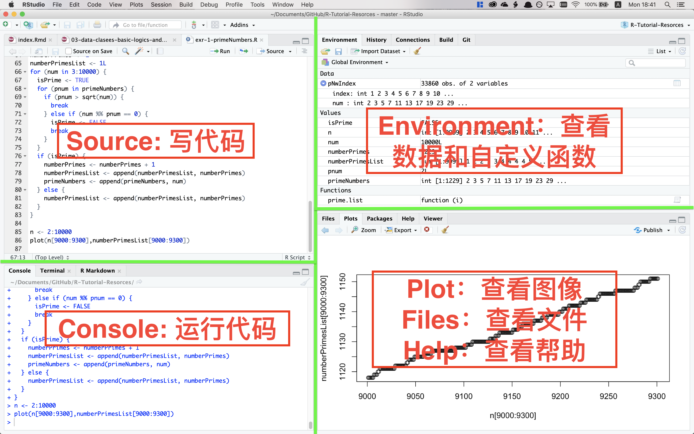

# R与RStudio安装与基础操作 {#intro-and-installation}

### 本章内容速览 {-#intro-overview}

第\@ref(what-is-R)节：对R和RStudio进行概念和功能介绍，并介绍安装方式。

第\@ref(getting-help)节：**很重要**的一节。介绍了常用的帮助和学习资源获取方式。

第\@ref(interface-basics-project)节：带你快速熟悉RStudio界面和基本操作。

第\@ref(packages)节：也**很重要**。介绍packages（包）的概念和功能，并引导安装本书需要使用的packages.

## 什么是R {#what-is-R}

R [@R-base]包含R语言和一个有着强大的统计分析及作图功能的软件系统，由新西兰奥克兰大学的Ross Ihaka和Robert Gentleman共同开发。R语言虽然看起来只能做统计，实际上它麻雀虽小，五脏俱全，编程语言该有的特性它基本都有（[甚至支持OOP](https://adv-r.hadley.nz/oo.html)）。

不要看到编程就害怕。**使用R不需要懂编程**。R语言最重要的特性之一就是，不懂编程的人可以轻松地用R自带的和和其他人编写的packages，实现99.9%他们想要的功能（主要是数据分析）；而懂编程的人可以轻松地使用编程，在R中实现他们想要的剩余的0.1%的功能。同时，R的编程语言非常简单易学，尤其是对于编程0基础的R使用者。像SAS，STATA这些商业软件，只能实现你95%的需求，且剩下的5%很难解决。

安装了R之后，你可以在其自带的“R”软件中使用（也可以直接在命令行使用），但是那个软件对新手的友好度不如RStudio. RStudio [@R-rstudio]是广受欢迎的R语言IDE（集成开发环境），它的一系列功能使得编辑，整理和管理R代码和项目方便很多。

了解更多R的优势，请看第\@ref(youshi)节

### 安装R和RStudio {#R-and-RStudio-install}

#### 安装R {#R-install}

https://cran.r-project.org

前往[CRAN](https://cran.r-project.org)，根据自己的操作系统（Linux，MacOS或Windows）选择下载安装R. (Linux用户亦可参考[此处](https://blog.zenggyu.com/en/post/2018-01-29/installing-r-r-packages-e-g-tidyverse-and-rstudio-on-ubuntu-linux/))

#### 安装RStudio {#RStudio-install}

https://www.rstudio.com/products/rstudio/download/

前往[RStudio下载页](https://www.rstudio.com/products/rstudio/download/)，选择最左边免费的开源版本，然后选择对应自己的操作系统的版本，下载并安装。

### 为什么使用R，R与其他统计软件的比较[^0] {#youshi}

[^0]: Gentleman, R. (2009). *R Programming for Bioinformatics*. Boca Raton, FL: CRC Press.

（这一小节不影响R的学习进度，可以直接跳过到[下一章](#getting-help)）

SAS，SPSS，Prism，R和Python是数据分析和科研作图常用的软件。

SAS，SPSS和Prism都是收费的，而且不便宜。比如SAS第一年需要[10000多美元](http://www.sas.com/store/products-solutions/cSoftware-p1.html)，随后每年要缴纳几千美元的年费。

R是GNU计划的一部分，因此R是一个自由软件 (Libre software)。它不仅免费，还允许用户自由地学习，运行该软件；拷贝，分发，修改并改进该软件，以帮助其他人。你可以 在[GNU官网](https://www.gnu.org/philosophy/free-sw.zh-cn.html)了解更多。

R比各种商业统计软件功能更强大。没错，**免费的R比昂贵的商业软件功能更强大**。所有SAS中的功能，都能在R中实现，而很多R中的功能无法在SAS中实现[^sas]。

[^sas]: https://thomaswdinsmore.com/2014/12/15/sas-versus-r-part-two/

R有巨大的用户社群[^users]，其中有很多热心的使用者/开发者在论坛上解答问题，或是编写免费获取的教程。SAS等软件虽然有客户支持，但是如果你用的是盗版……

[^users]: https://blog.revolutionanalytics.com/2014/04/a-world-map-of-r-user-activity.html

R（RStudio）非常稳定。闪退率极低，而且就算闪退了，也完全不会丢失上一次工作中的数据，可以无缝衔接上一次的工作。我经常会创建一两个实验用的R script文件，我不需要把它们命名并保存在我的工作目录，重启RStudio的时候仍然可以使用它们。总之，关闭RStudio的时候，你甚至可以什么都不用保存；关闭，重启，无忧无虑地继续工作。设置Git后体验更佳。

R与其它编程语言/数据库之间有很好的接口。比如`dbplyr` package帮助你方便地把R和数据库（MySQL, MariaDB, Postgres等等）连接起来，`reticulate`可以让你在R中使用Python.

Python（NumPy和SciPy）是近几年兴起的数据分析处理方案。在数据分析的应用中，R比Python历史更悠久，因此积攒了很多很棒的packages（包）。一般来说，python的强项是数据挖掘，而R的强项是数据分析，它们都是强大的工具。不用担心需要在二者之中做选择，因为`rpy`, `reticulate`等packages可以让你在python中使用R，在R中使用python，详情请见第\@ref(python)章。无论你是数据分析零基础，还是有python数据分析的经验，都能从本书中获益。

至于Excel，它的定位原本就是办公（而不是学术）软件，数据分析的严谨性，大数据的处理能力，和功能的拓展非常局限。有五分之一的使用了Excel的遗传学论文，数据都出现了偏差 [@Ziemann2016Gene-name-errors]。对了，Excel和SPSS和其它一些软件绘图的时候，坐标轴和/或图例中的文字竟然不能上下标！

我也不是说要严禁使用Excel（或者其它可用的工具），而是要清楚各种工具的优势和局限，物尽其用。比如当需要从PDF文件中提取表格数据时，我会把它们复制到Excel（因为兼容性强）；我也会用Excel做一些数据的初步处理，比如删除数量不多的冗余的行和列，重命名变量名等。

虽然R是自由软件，但是我们要记得感激所有位R贡献智慧的奉献者。出于对知识劳动的尊重和，以及保持R的发展壮大，我呼吁有能力出资的使用者在https://www.r-project.org/foundation/donations.html 对R进行捐赠。

## 获取资源与帮助（重要！） {#getting-help}

这本书可以帮助你快速学会R和tidyverse的最常用和最重要的操作，但这仅仅是冰山一角。当你在做自己的研究的时候，会用到很多这本书中没有讲到的方法，因此学会获取资源和帮助是很重要的。以下列举几个常用的获取R的帮助的网站/方法：

### 核心/入门资源

#### 论坛类（解答实际操作中的问题） {#forum}

- [爆栈网 (StackOverflow)](https://stackoverflow.com)是著名计算机技术问答网站（如果你有其他的编程语言基础，一定对它不陌生）。查找问题的时候加上`[R]`，这样搜索结果就都是与R相关的了（为了进一步缩小搜索范围，可以加上其他的tag，比如`[ggplot]`, `[dplyr]`)。注意，提问和回答的时候话语尽量精简，不要在任何地方出现与问题无关的话（包括客套话如“谢谢”），了解更多请查看其[新手向导](https://stackoverflow.com/tour)。
- 由谢益辉大佬在2006年（竟然比爆栈网更早！）创建的[“统计之都”论坛](https://d.cosx.org)，是做的最好的一个面向R的中文论坛（但是客观地来说活跃度还是没爆栈网高）同样不要忘记读新手指引。

#### Reference类（查找特定的function/package的用法） {#reference}

- 直接在R console中执行`?`+`函数名称或者package名或者其它`，比如`?t.test`，可以查看对应函数的帮助文档（documentation）有一些函数/packages/内容名需要加上引号，比如`?"+"`, `?"if"`。有一个相似的方法，`??`+`"内容"`可以根据你输入的内容搜索帮助文档，比如`??"probability distrubution"`。
- [RDocumentation](https://www.rdocumentation.org)上有基础R语言和来自CRAN，GitHub和Bioconductor上的近18000个packages的所有的函数的说明和使用例。
- 有些packages会在官网或github仓库提供使用说明，比如[tidyverse](https://www.tidyverse.org)
- 有些packages会提供vignettes，它们类似于使用指南，相比于函数的帮助文档更为详细且更易读。`vignette()`（无参数）以查看全部可用vignettes. 试试`vignette("Sweave")`。

#### 教程和书籍类（用来系统地学习） {#manual-type}

- [*R for Data Science* by Garrett Grolemund & Hadley Wickham](https://r4ds.had.co.nz). `tidyverse`的作者写的一本书，较为详细地介绍了`tidyverse`的用法以及一些更高深的关于编程的内容。（[练习题答案](https://jrnold.github.io/r4ds-exercise-solutions/)）
- [*R for Beginners* by Emmanuel Paradis](https://cran.r-project.org/doc/contrib/Paradis-rdebuts_en.pdf)及其[中文译本](https://github.com/DingGuohui/R-for-beginer/blob/master/rdebuts_cn%200.2.pdf)
- R的[官方Manuals](https://cran.r-project.org/manuals.html).
是一组严谨，全面但略微枯燥的文档，可能不太适合零基础的新手，但是对于精通R有很大的帮助。部分由[丁国徽](https://github.com/dingguohui)翻译成中文。
- [RStudio Resources](https://resources.rstudio.com)是RStudio的资源区，有关于R和RStudio的高质量教程，还可以下载很多方便实用的Cheat Sheet. 
- R的[官方FAQ](https://cran.r-project.org)（在左侧菜单栏中找到“FAQ”）
- 存储在CRAN上的[中文FAQ](https://cran.r-project.org/doc/contrib/Liu-FAQ.pdf)（注意这不是英文FAQ的翻译，而是一本独立的R入门教程）

#### 速查表 (Cheat sheets)（用来贴墙上） {#cheatsheet}

- [R Reference Card 2.0 by Mayy Baggott & Tom Short](https://cran.r-project.org/doc/contrib/Baggott-refcard-v2.pdf)以及其第一版的[中文翻译](https://cran.r-project.org/doc/contrib/Liu-R-refcard.pdf)
- [RStudio Cheat Sheets](https://www.rstudio.com/resources/cheatsheets/)包含了RStudio IDE和常用packages的cheat sheets。2019年版的合集[在这里](https://www.rstudio.com/wp-content/uploads/2019/01/Cheatsheets_2019.pdf)。

### 进阶资源

- [*The R Book* by Michael J. Crawley](https://github.com/TianyiShi2001/R-Tutorial-Resorces/blob/master/资源/书籍/TheRBook.pdf)
- [*Advanced* R by Hadley Wickham](https://adv-r.hadley.nz/index.html)及其[练习题答案](https://advanced-r-solutions.rbind.io)。
- CRC的[The R Series](https://www.crcpress.com/Chapman--HallCRC-The-R-Series/book-series/CRCTHERSER)
- Springer的[*Use R!* Series](https://www.springer.com/series/6991?detailsPage=titles)。
- Venables & Ripley (2002). *S Programming*.

## RStudio界面介绍，基本操作，和创建新项目 {#interface-basics-project}

### 界面 {#interface}

#### 概览 {#interface-overview}

```{r echo=FALSE, out.width='100%'}

```

#### 左下角：Console（控制台） {#console}

Console是执行代码的地方。试试在里面输入`1 + 1`并按回车以执行。

#### 左上角：Source（源） {#source}

Source是写代码的地方。请看第\@ref(Rscript)节。

这个位置也是用来查看文件和数据的地方。试试在console中执行`View(airquality)`或`library(help = "stats")`.

#### 右上角：Environment（环境） {#environment}

Environment 是一个列表，显示了所有当前工作环境中所有的对象，包括变量（“values”和“data”）和自定义的函数（functions），并简要显示了它们对应的值。

History（历史）和 Connections（连接）不太常使用。

#### 右下角：Plots（绘图），Help（帮助），Files（文件）和Packages（包） {#bottomright}

Plots是预览图像的区域。试试在console中执行`hist(rnorm(10000))`.

Help是查看帮助文档的区域。试试在console中执行`?hist`或`?norm`.

Files是查看文件的区域，默认显示工作目录 (working directory)。

Packages是安装/查看/更新packages（包）的区域。详情请看第\@ref(packages)章。

### 执行代码 {#execution}

#### 计算和赋值

我本来不想在开篇就写一小节使用较多的术语的文字，但是R中计算和赋值的概念实在太重要了，我不得不把它放在这里。

**几乎所有R中的指令可以归为两种。计算 (evaluation)或者赋值 (assignment).[^exact]**

[^exact]: 准确地说，赋值也是一种计算。赋值符号本身就是一个函数，你可以用`"<-"(x, 5)`把`5`赋值给`x`。

没有`<-`符号的为计算，有`<-`符号的为赋值。

大多数情况下，计算仅仅会产生效果（或是在console输出结果，或是在plot区产生图像，或是在工作目录新建一个pdf文件），赋值会且仅会改变一个对象（变量）的值（包括新建一个对象），并且不会产生其他的效果。[^exc]

[^exc]: 有一些计算不支持赋值。当强行赋值的时候，会产生效果，但赋值的值为`NULL`，比如`x <- pdf()`会在工作目录新建一个pdf，并新建了对象`x`，但x的值为`NULL`. 有一些计算支持赋值，但是同时也会产生效果，比如`hist(rnorm(1000))`（以list的形式赋值）。

首先我们来做一个**计算**。

在console里输入`1 + 1`，并按回车以执行。你的console会显示：

```{}
> 1 + 1
[1] 2
```

其中`2`是计算结果， `[1]`是索引，在第\@ref(indexing)节有解释。`> 1 + 1`是input，`[1] 2`是output.

还是用`1 + 1`举例，在本书中，对于input和output的展示格式是这样的：

```{r}
1+1
```

注意input中的`>`被省略了，这意味着你可以很方便地直接把代码从本书复制到你的console并按回车执行（因为console本身自带了`>`)。

再执行以下指令（在RStudio中，可以用`Alt`+`-` (Mac是 `option`+`-`) 这个快捷键打出这个符号。）：

```{r}
x <- 5*5+1
```

这是一个**赋值**指令。计算结果不会显示，但是你新建了一个名为`x`的变量（准确地说，是“对象”），值为`5*5+1`的计算结果，即`26`. 你可以执行`x`来查看`x`的值：

```{r}
x
```

像一个小箭头的赋值符号（`<-`）的作用是[^reverse]，**首先**计算出其右边的指令（必须是一个计算指令；即同一条指令不可以出现两个`<-`符号），然后把**计算结果的值**作为一个**拷贝**赋予给左边的名字，这样就新建了一个对象 (object)。每个对象有一个名称和一个值。[^object-attr]左右是很重要的；绝大多数其他的编程语言，虽然赋值符号是`=`，但也是从右往左赋值，R使用`<-`作为赋值符号更形象，避免新手写出像`5 = x`之类的指令。当然，如果你喜欢，也可以在R中使用`=`。[^equal-sign]

[^equal-sign]: 其实可以用`=`替代`<-`作为赋值符号，但是更多的R用户还是采用传统的的`<-`符号，而`=`则用于给**函数的参数**赋值。这种区分可以使代码可读性更强（更容易看出哪些语句是赋值，哪些是计算）。当然，如果你真的非常非常想用`=`符号，也是可以接受的。

[^reverse]: 其实你还可以把这个小箭头反过来，试试`5 -> x`. 但是不建议这么做。代码易读性会变差。

[^object-attr]: 每个对象还可以有一些（可选的）attributes（属性）。

`<-`用于给任何对象赋值，包括常用的向量 (vector)，列表 (list)，数据框 (dataframe)和函数 (function)。

谨记，赋值符号只是把右边的**计算结果**作为一个**拷贝**赋予给左边，而不会做任何其它的事情[^assign]。变化的仅仅是左边的变量（对象），右边的计算中所用到的任何变量（对象）**不会改变**！

[^assign]: 一个特例是environment（环境）的赋值。初学者不需要知道。

为什么强调是一个拷贝呢？举个例子，我们现在把`x`的值赋予给`y`，不出所料，`y`的值将为`26`。那么要是我们在这之后重定义`x`为`40`，y的值是多少呢？

```{r}
y <- x
x <- 40
y
```

还是26（而不是40）。赋值是一次性的，每次被赋值的对象都将成为独立自主的个体。对象y虽然在被赋值的时候需要用到对象x，但是在那之后y和x半毛钱关系都没有了（除非再次赋值），所以x的变化不会影响y，y的变化也不会影响x。

**所有的变化，只可能发生在赋值。**

#### 计算和函数

所有的计算都是通过函数实现的，包括当你输入`x`然后按回车时。[^invisible]像`+`, `-`这样的运算符也是函数（参见第\@ref(functions-in-R)节）。

[^invisible]: 查看`x`的值，我们只需要输入`x`然后按回车，然后我们在console看到了`x`的值。这其实也是用函数实现的。当一个指令不是赋值时，R默认会对整个指令使用`print()`函数。因此，`2 + 4`等同于`print(2 + 4)`, `x`等同于`print(x)`. 当一个指令是赋值是，R默认会对右边的整个指令使用`invisible()`函数，因此，`y <- x`等同于`y <- invisible(x)`.

函数的标志是小（圆）括号，比如`sum(6, 7, 8)`是求`6`, `7`和`8`的和；其中`sum()`是函数，`6, 7, 8`是（三个参数）。

函数可以嵌套使用，而且很常见。

```{r}
prod(sqrt(sum(2, 3, 4)), 2, 5)
```

最“内部的”函数先运行，然后把计算结果作为它外面的函数的参数。这里，`sum(2, 3, 4)`得到`9`, `sqrt(9)`得到`3`, `prod(3, 2, 5)`得到`30`. 就像小学的时候学的括号运算规则一样。

更多关于函数的知识请参阅第\@ref(functions)节。

### 管理代码 {#code-management}

#### 创建R Project {#project-create}

试着在console里输入（或者复制）以下代码并执行：

```{r}
attach(airquality)
plot(Wind, Ozone, main = "Ozone and Wind in New York City", pch = 20)
model <- lm(Ozone ~ Wind, airquality)
abline(model, lwd = 2)
```

可以看到，在plots区，生成了一副漂亮的图。（先别在意每行代码具体的作用，在之后的章节我会一一讲述）

这时，把RStudio关掉，再重新启动，你会发现你的图没了。因此我们需要记录和管理代码。

初学者经常会在console里写代码，或者从别处复制代码，并执行。这对于一次性的计算（比如写统计学作业时用R来算线性回归的参数）很方便，但是如果你想保存你的工作，你需要把它们记录在R script文件里。如果你的工作比较复杂，比如有一个excel表格作为数据源，然后在R中用不同的方法分析，导出图表，这时候你会希望这些文件都集中在一起。你可以使用R Project来管理它们。

1. 左上角File > New Project
2. 点选New Directory > New Project 
3. 输入名称和目录并Create Project

#### 使用R Project {#project-use}

在创建R project的文件夹中打开`.Rproj`文件。或者，RStudio启动的时候默认会使用上一次所使用的R project. 

随后，你在RStudio中做的所有工作都会被保存到`.Rproj`所在的这个文件夹（正规的说法是“工作目录” (working directory)）。比如，在console中执行：

```{r eval=FALSE}
pdf("normalDistrubution.pdf")
curve(dnorm(x),-5,5)
dev.off()
```

一个正态分布的图像便以pdf格式保存在了工作目录。你可以在系统的文件管理器中，或是在RStudio右下角File面板中找到。

#### 写/保存/运行R script {#Rscript}

在console中运行代码，代码得不到保存。代码需保存在R script文件（后缀为`.R`）里。

`Ctrl`+`Shift`+`N`（Mac是`command`+`shift`+`N`）以创建新R script. 

然后就可以写R script. 合理使用换行可以使你的代码更易读。`#`是注释符号。每行第一个`#`以及之后的内容不会被执行。之前的例子，可以写成这样：

```{r eval=FALSE}
# 读取数据
attach(airquality)

# 绘图
plot(Wind, Ozone, # x轴和y轴
     main = "Ozone and Wind in New York City", # 标题
     pch = 20) # 使用实心圆点
model <- lm(Ozone ~ Wind, airquality) # 线性回归模型
abline(model, lwd = 2) # 回归线
```

点击你想执行的语句，按`Ctrl`+`Enter` (`command`+`return`)以执行那一“句”语句（比如上面的例子中，从`plot(Wind...`到`pch = 20)`有三行，但是它是一“句”），然后光标会跳至下一句开头。

`Ctrl`+`Shift`+`Enter` (`command`+`shift`+`return`)以从头到尾执行所有代码。

通过`Ctrl`（+`Shift`）+`Enter`执行代码时，相关代码相当于是从R script中复制到了console并执行。

试试复制并执行以上代码吧。

`Ctrl`+`S` (`command`+`S`)以保存R script. 保存后会在工作目录找到你新保存的`.R`文件。重新启动RStudio的时候，便可以打开对应的R script文件以重复/继续之前的工作。

### RStudio的额外福利[^fuli] {rstudio-fuli}

[^fuli]: 一切福利都可以在设置中取消。

#### 括号/引号自动补齐；换行自动缩进

在RStudio中，除非你故意，否则很难出现括号不完整的错误。当你打出一个左括号/引号 (`(`, `[`, `{`, `"`, `'`)时，对应的右括号/引号会自动补齐，同时光标移动到括号/引号的中间。

当你在括号中间换行时，右括号和光标会移动到正确的位置。举个例子，我打出下面这两段代码的时候不需要手动输入任何空格或者`TAB`来实现正确的缩进：

```{r}
mklog <- function(x){
  function(y){
    log(y, x)
  }
}

x <- tibble(nums = c(1, 2, 3),
            chars = c("a", "b", "c"),
            cplx = c(1+5i, 2+3i, 6+8i))
```

#### 自动完成/建议提示/快速帮助 (autocomplete) {#autocomplete}

当你在console或者source区输入三个[^auto-3]或更多字母时，R会提示以这三个字母开头的所有对象（不一定是packages里的函数，也可以自定义的向量，列表，函数等等）。

[^auto-3]: 可以在设置中，自定义所需输入的最少字母和延迟。默认分别为3个字母和250毫秒。

```{r echo=FALSE, out.width='100%'}
knitr::include_graphics("img/rstudio-fuli/auto.png")
```

然后，你可以用键盘的“上”，“下”键去选择，然后按回车键完成（或者用鼠标点选）。如果对象是一个函数，会自动帮你补齐括号。

注意，当你选中一个函数时，右边会有一个黄色的方框，提示这个函数的参数名称和参数选项，以及一段简要说明。如果你这时想查看此函数的帮助文档，按`F1`即可。

通过`$`符号取子集的时候，R会自动列举所有可用的子集（用于列表和数据框/tibble）。类似地，在package名后输入`::`准备调用函数时，R会列举该package所有可用函数（见第\@ref(pkg-colon)节）。

```{r echo=FALSE, out.width='100%'}
knitr::include_graphics("img/rstudio-fuli/auto-sub.png")
```

### 一些实用的快捷键 {#useful-shortcuts}

#### 快速插入标题 {#heading-insert}

当一份R script文件写得很长的时候，用注释+横线作为小标题把整个文件分割成很多块可以增强易读性：

```{r}
# foo ---------------------------------------------------------------------

print(1)

# bar ---------------------------------------------------------------------

x <- 2

# some other code
# blah blah blah
```

在RStudio中，可以通过`Ctrl` (`command`) + `shift` + `R`快速插入像上面`foo`, `bar`这样的小标题。更棒的是，在source栏左下角，可以根据小标题快速定位：

```{r echo=FALSE}

```


### 其他 {#misc}

#### “一句”的概念

一次计算（一个单句）执行且执行一个函数（不包括里面嵌套着的函数）。

当你通过`函数名` + `(`“开启”一次运算时，从这里开始到*这个函数所对应的*反括号，即`)`之前的内容，即使再多，都只是这个函数的参数。

当你在R script里敲击`Ctrl`+`Enter`时，光标所在的位置的那一句指令将会被执行（无需在那一句的开头，可以在那一句之中的任何位置）；如果那句命令不完整，会在console中用`+`提示（见下一小节）。

单句与单句之间必须换行，或者用分号（`;`）连接：

```{r eval=FALSE}
sum(1, 9)
sum(2, 3)
# 和
sum(1, 9); sum(2, 3)
# 都是可以的，而
sum(1, 9) sum(2, 3)
# 不可以，会出错
```

在同一行用分号分隔的几句代码会按顺序被一起执行，但是每个单句分别产生一个效果/分别返回一个结果。

```{r collapse=TRUE}
sum(1, 9); mean(2, 3); x <- 5; x + 1
```


我们还可以使用大括号构建复合句。**在大括号开头处执行代码**，括号里的内容会按顺序执行，但是只会返回最后一步的计算结果。

```{r collapse=FALSE}
{
  sum(1, 9)
  mean(2, 3)
  x <- 5
  x + 1
}
```

复合句在[自定义函数](#create-functions)和[流程控制](#control-flow)中经常使用。

#### 关于换行 {#newline}

Console 中每个命令开头的`>`叫做prompt（命令提示符），当它出现在你所编辑的那一行的开头时，按下回车的时候那行的命令才会被执行。有时候它会消失，这时候按`esc`可以将其恢复。

prompt消失的主要原因是你的代码没有写完，比如括号不完整：

```{}
> 2+(3+4
```

这时你按回车，它会显示：

```{}
> 2+(3+4
+
```

`+`号是在提示代码没写完整。这时你把括号补上再按回车：

```{}
> 2+(3+4
+ )
```

```{}
[1] 9
```

便可以完成计算。

## 安装和使用packages (包) {#packages}

### Package是什么，为什么使用它们？{#packages-what}

Package是别人写好的在R中运行的程序（以及附带的数据和文档），你可以免费安装和使用它们。

Packages可以增加在基础R语言中没有的功能，可以精简你代码的语句，或是提升使用体验。比如有个叫做`tikzDevice`的package可以将R中的图表导出成tikz语法的矢量图，方便在LaTeX中使用。本书的编写和排版也是使用R中的一个叫做`bookdown`的package完成的.  

这个课程主要是学习`tidyverse`这个package，

### 如何安装packages {#package-install}

首先我们安装tidyverse（**很重要，本书接下来的部分都要使用这个package**）：

```{r eval=FALSE}
install.packages("tidyverse")
```

在console中运行以上代码，R就会从[CRAN](https://cran.r-project.org)中下载tidyverse并安装到你电脑上的默认位置。因此安装packages需要网络连接。

如果想安装多个packages，你可以一行一行地安装，或是把多个packages的名字合成一列，同时安装，比如：

```{r eval=FALSE}
install.packages(c("nycflights13", "gapminder", "Lahman")
```

绝大多数的packages都能用这个方法安装，因为它们是被存储在CRAN上的。Bioconductor packages请看第\@ref(Bioconductor)节。

### 如何使用packages {#package-use}

#### 加载packages {#pkg-load}

安装packages后，有两种方法使用它们。以`tidyverse`为例：

```{r eval=FALSE}
library('tidyverse')
```
或
```{r eval=FALSE}
require('tidyverse')
```

两者的效果很大程度上都是一样的，都可以用来读取**单个**package。它们的不同，以及如何通过一行指令读取多个packages，请参看第\@ref(require-and-library)节。

每次重启R的时候，上一次使用的packages都会被清空，所以需要重新读取。因此我们要在R script里面记录此script需要使用的packages（这个特性可以帮助你养成好习惯：当你把你的代码分享给别人的时候，要保证在别人的电脑上也能正常运行，就必须要指明要使用哪些packages）.[^another-reason]

[^another-reason]: 另一个主要原因是，寻找对象时，R需要搜索所有已加载的packages，而且，packages都被加载在RAM里，因此加载过多的packages会使R显著变慢。（虽然有一些开挂的方法）

#### 使用packages里的内容 {#pkg-colon}

刚才加载`tidyverse`的时候，你也许注意到了这样一条提示：

```{}
── Conflicts ─────────────── tidyverse_conflicts() ──
✖ dplyr::filter() masks stats::filter()
✖ dplyr::lag()    masks stats::lag()
```

这是因为R本来自带了一个叫做`stats`的package，有俩函数名曰`filter()`和`lag()`，而`dplyr`（`tidyverse`的一部分）也有同名的俩函数，把原来的覆盖了。所以它提示你，当你使用`filter()`和`lag()`时，使用的是`dplyr`的版本，而不是原来`stats`里的。

这不意味着`stats`里的这两个函数就不能用了。要使用他们，用这个格式就好了：

```{r eval=FALSE}
stats::filter()
```

同样的道理也适用于其他的packages. 你可以通过

```{r eval=FALSE}
dplyr::filter()
```

使用`dplyr`版本的`filter()`。虽然这是个好习惯，但是很少人这么做（除非你是开发者）。Python里每使用一次NumPy里的函数都要加上`np_`的前缀，虽然严谨，但是麻烦。R的一大便利之处就是使用packages里的内容时，不强制要求指定packages的名称。如果函数/对象名称有重叠，以packages的加载顺序决定优先度；最近（即最后）被加载的package里的函数/对象胜出，而其余的要通过`packageName::object`的形式调取。

#### 更新和卸载packages {#update-and-uninstall}

更新：`update.packages()`；卸载：`remove.packages()`；两者皆可在RStudio右下角的Packages区进行操作。

### 其它 {#package-misc}

这小节是一些不重要的内容，因此**可酌情跳到下一章（第\@ref(vectors-logicals-and-functions)章）。**

#### `library()`和`require`的区别；如何使用一行指令读取多个packages {#require-and-library}

1. `require()`会返回一个逻辑值。如果package读取成功，会返回`TRUE`，反之则返回`FALSE`.
2. `library()`如果读取试图读取不存在的package，会直接造成错误(error)，而`require()`不会造成错误，只会产生一个警告(warning).

这意味着`require()`可以用来同时读取多个packages：

```{r eval=FALSE}
lapply(c("dplyr","ggplot2"), require, character.only = TRUE)
```
或者更精简一点，
```{r eval=FALSE}
lapply(c("dplyr","ggplot2"), require, c = T)
```


#### 安装Bioconductor packages {#Bioconductor}

[Bioconductor](https://bioconductor.org)是一系列用于生物信息学的R packages. 截止2019年7月2日，共有1741个可用的bioconductor packages. 它们没有被存储在CRAN上，因此需要用特殊的方法安装。首先，安装一系列Bioconductor的核心packages（可能需要几分钟）：

```{r eval=FALSE}
source("http://bioconductor.org/biocLite.R")
biocLite()
```

然后，通过`biocLite()`函数安装其它packages，比如：

```{r eval=FALSE}
biocLite("RforProteomics")
```

## 小测 {test-intro}

### 基础 {test-intro-basics}

1. **计算。**

    z`等于多少？为什么？

    ```{r eval=FALSE}
z <- {
  x <- 6
  y <- 7
  x + y
  x <- 10
  x - y
  x * y
}
    ```

    下面两行代码的运算结果分别是什么？z的值分别是什么？

    ```{r eval=FALSE}
z <- x <- 0; x + 1
z <- {x <- 0; x + 1}
    ```

### 进阶 {test-intro-advanced}

建议读完下一章再来做这些题。

1. **计算。**

    ```{r eval=FALSE}
rep(
  seq(10, 100, 10),
  rep(1:4, c(2, 1, 4, 3))
)
    ```

    ```{r eval=FALSE}
rep({
  x <- 5
  x <- x+5
  x
}, 3)
    ```

    ```{r eval=FALSE}
greet <- function(t) {
  print(if(t == 1) "早上好" else if(t == 2) "下午好" else if(t == 3) "晚上好")
}

t = 1; greet(t)
t = 3; greet(t)
    ```


