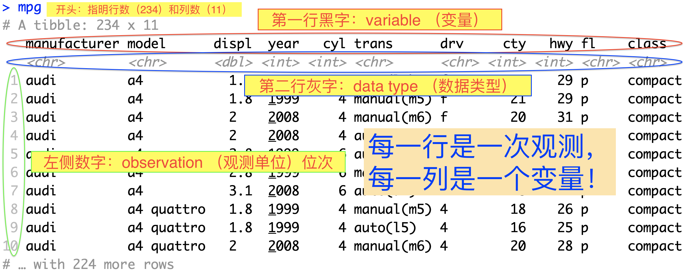
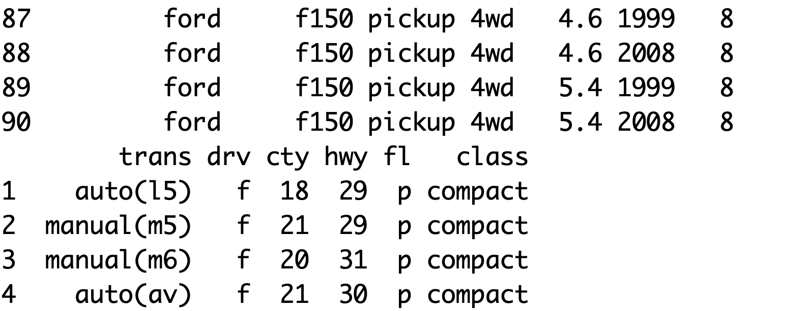
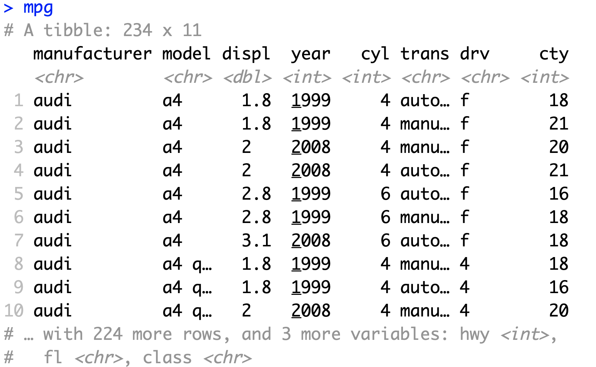

# dataframe和tibble {#tibble}

### 本章内容速览

R中的多变量数据的标准保存形式是dataframe；tibble是dataframe的进化版。

- 第\@ref(tibble-view)节介绍了dataframe/tibble的基本概念以及如何查看数据。
- 第\@ref(tibble-create)节介绍了tibble的创建——直接创建，从dataframe转换，或是从外部导入。
- 第\@ref(data-transformation)介绍了数据转换，即对原有的数据做一些筛选和简单的计算处理。

## 查看dataframe/tibble并了解它们的结构 {#tibble-view}

### dataframe/tibble的基本概念 {#tibble-concept}

dataframe是R中存储复杂（多变量）数据的规范格式，它直观易操作。tibble是tidyverse的一部分，它是dataframe的进化版，功能更强大，更易操作。

我们来看个例子：

首先加载tidyverse：

```{r eval=FALSE}
require(tidyverse)
```

**以后每次跟着本书使用R的时候，都要先加载tidyverse，不再重复提醒了。**

tidyverse中自带一些范例数据，比如我们输入：

```{r eval=FALSE}
mpg
```

```{r echo=FALSE, out.width='100%'}

```

一个正确的dataframe/tibble，每一行代表的是一个observation（硬翻译的话是“观测单位”，但是我觉得这个翻译不好），每一列代表的是一个variable（变量），且同一个变量的数据类型必须一样。像这样的数据被称为“tidy data”（“整齐的数据”）。虽然看起来简单，直观，理所当然，但是现实中上人们经常会做出“不整齐”的数据。把不整齐的数据弄整齐是第\@ref(wrangle)章的重点。

### 查看更多数据 {#tibble-more-data}

R默认显示tibble的前10行。如果想看前n行或最后n行，可以分别使用`head()`和`tail()`函数，比如：

```{r}
tail(mpg, 6) # `mpg`的最后6行
```

若要在source栏中从头到尾查看全部数据，可以使用`View`函数：

```{r eval=FALSE}
View(mpg)
```

## 创建tibble {#tibble-create}

### 手动输入数据以创建tibble {#tibble-create-manual}

使用`tibble()`函数[^tribble]，按以下格式创建tibble. 换行不是必须的，但是换行会看得更清楚。如果换行，不要忘记行末的逗号。

[^tribble]: `tribble()`函数亦可用来创建新tibble. 与`tibble()`的区别是，`tibble()`逐列写入数据，`tribble()`逐行写入数据。查看帮助文档获取使用例。

```{r}
my_tibble_1 <- tibble(
                nums = c(4, 5, 6),
                chars = c("hej", "你好", "こんにちは"),
                cplxnums = c("4+8i", "3+5i", "3+4i")
                )
my_tibble_1
```

类似地，可以从现有的vector创建。**注意，所有变量的长度必须一样。**

```{r}
x <- c(1,  4 , 5 )
y <- c(211,23,45)
z <- c(20 ,32)
```

```{r}
my_tibble_2 <- tibble(v1 = x, v2 = y)
my_tibble_2
```

而试图把`x`和`z`做成tibble就会报错：

```{r eval=FALSE}
my_tibble_3 <- tibble(w1 = x, w2 = z)

 # Error: Tibble columns must have consistent lengths, only values of length one are recycled: * Length 2: Column `w2` * Length 3: Column `w1`
```

### 把dataframe转换成一个tibble {#tibble-create-from-df}

```{r eval=FALSE}
d1 <- as_tibble(d) #其中d是一个dataframe
```

### 从外部数据创建tibble {#tibble-import}

参见第\@ref(data-import)节（数据的导入）


## 数据转换 (Data Transformation) {#data-transformation}

数据转换，简而言之，就是对原有数据的展示形式做一些改动，因而把最有意义的数值以易读的形式展示出来，或是为绘图做准备。

### 取子集（抓取行，列）{tbl-subsetting}

本小节介绍了如何使用`dplyr` package提供的`select()`, `filter()`, `slice`取子集方法
更详细的解释请看第\@ref(tbl-subsetting-more)节。

这一小节我们使用名为`iris`的数据。它是一个dataframe，所以首先把它转换成tibble. 

```{r}
iris <- as_tibble(datasets::iris)
iris
```

#### 抓取单列 {#single-column}

抓取单列很简单，也很常用（比如我们只想从一个大的tibble中抓两个变量研究它们之间的关系）。 有两个符号可以用于抓取列，`$`（仅用于变量名称）与`[[]]`（变量名称或索引）。还是以`mpg`为例，假设我们要抓取第2列 (`Sepal.Width`)：

```{r eval=FALSE}
# 通过变量名称抓取 -----------------------
iris[["Sepal.Width"]]
#或
iris$Sepal.Width #

# 通过索引抓取 ------------------------
iris[[2]]
```

以上三种方法都应得到同样的结果（是一个vector）：

```{r echo=FALSE}
iris[["Sepal.Width"]][1:20] 
#为避免浪费空间我们只显示第1到10个元素。
```

一般，在RStudio中使用`$`符号最方便，因为打出“$”之后会自动提示变量名。

一般我们抓取单列是为了在tibble中新建一个与那一列相关的变量，或是建一个新tibble，或是做统计学分析。以上三种情况（是绝大多数的情况）用vector进行操作很方便。

使用单方括号`[`进行取子集得到的结果是一个tibble（试试`iris[2]`）这个特性在第\@ref(tbl-subsetting-more)节中有解释。

#### 使用`select()`函数，抓取多列并返回一个tibble

有时候，一个tibble中含有很多冗余信息，我们可能想把感兴趣的几个变量抓出来做一个新tibble. 这时`select()`函数最为方便。可以用变量名称或者索引来抓取；可以在前面加上负号表示“除这个变量以外”。比如：

```{r}
iris_1 <- select(iris, 1:2, 5)
# 等同于
iris_1 <- select(iris, -(3:4))
# 等同于
iris_1 <- select(iris, -Petal.Length, -Petal.Width)

iris_1[1:3, ] # 节省空间，1至3行。
```

使用“正”的变量名称进行抓取，可以额外地按照你指定的顺序重排（抓取的是同样的数据，但是`Species`被放在第一列）：

```{r}
iris_1 <- select(iris, Species, Sepal.Length, Sepal.Width)
iris_1[1:3, ]
```


#### 通过`filter()`，抓取满足某条件的行

通过`filter()`，我们可以过滤出某个或多个变量满足某种条件的observations. 如果你还不熟悉逻辑运算，请看第\@ref(logical-operation)节

假设我们只想看种名为$virginica$且花瓣长度在4和5之间的鸢尾花：

```{r}
iris_2 <- filter(iris, Species == "virginica", Petal.Length >= 4 & Petal.Length < 5)

iris_2
```

#### 用`slice()`，通过行数（索引）抓取行 {#tibble-slice-sample}

```{r}
iris_3 <- slice(iris, 21:24) # 抓取`iris`的第21行至24行
iris_3
```

`slice()`更实际的用途是随机选择个体：

```{r}
iris_random <- slice(iris, sample(length(iris[[1]]), 4, replace = FALSE)) # 随机四朵鸢尾花
iris_random
```

还可以使用`[n, ]`的形式抓取（不需要知道为什么）：

```{r}
iris[1:3, ] # 第1到第3行
```


### 使用`arrange()`排序tibble

有时候，你需要把表格展示（打印）出来，为了方便阅读，经常需要重新排列每行的顺序。

把`iris`根据萼片长度`Sepal.Length`从小到大的顺序排列：

```{r}
arrange(iris, Sepal.Length)
```

根据`Sepal.Length`从大到小的顺序排列：

```{r}
arrange(iris, -Sepal.Length) # 或`arrange(iris, desc(Sepal.Length))`
```

根据`Petal.Width`从小到大的顺序排列，若有并列，再根据`Petal.Length`从大到小的顺序排列：

```{r}
arrange(iris, Petal.Width, -Petal.Length)
```

以此类推。

### 用`mutate()`修改或新增变量 {#mutate}

`mutate()`函数用于新增一列数据（即新增一个变量）。

这里用另外一组`datasets`里的数据举例。首先我们需要把它转换成tibble.

```{r}
women <- as_tibble(datasets::women)
women
```

它展示了两个变量，身高和体重。根据这两个变量我们可以算出BMI. 但是，首先，我们的单位正确吗？通过观察，身高的值在64左右，体重的值在140左右，显然不像是标准单位（千克和米）。这时，第一个寻求帮助的地方应该是帮助文档，通过`?women`打开。帮助文档中写道：

> `[,1]	height`  numeric	Height (in)         
> `[,2]	weight`	numeric	Weight (lbs)

原来分别是以英寸和磅做单位的。根据`1 m = 39.370 in`, `1 kg = 2.204 lbs`：

```{r}
women1 <- mutate(women, 
                height_in_m = height/39.37,
                weight_in_kg = weight/2.204)
women1
```

`mutate()`的第一个参数是dataframe/tibble的名称，接下来的参数都是变量名和它们所对应的值；可以直接在计算它们的值的表达式中使用tibble中原有的变量名，如`height`, `weight`。

当然你可以引用tibble外部的vector或者其它tibble的数据：

```{r}
h <- women1$height_in_m
women2 <- mutate(women, 
                 height_in_m = h, # 引用外部vector
                 weight_in_kg = women1$weight_in_kg) # 引用`women1`里的数据
identical(women2 ,women1) # 和`women1`是相同的
```

显然，`mutate()`也可以用来重新赋值原有变量。假设我们根本不再需要以英寸和磅作为单位的数据，我们可以：

```{r}
women3 <- mutate(women, height = height/39.37, weight = weight/2.204)
head(women3, 3)
```

接下来我们可以愉快地算BMI了：

```{r}
women_bmi_1 <- mutate(women3, BMI = weight/height^2)
head(women_bmi_1, 4)
```

如果你在创建新变量后，不想保留原有变量，可以用`transmute()`函数：

```{r}
women_bmi_2 <- transmute(women3, BMI = weight/height^2)
head(women_bmi_2, 4)
```

### 使用`rename()`重命名变量

```{r}
women_bmi_1[1:3, ]
```

```{r}
women_bmi_3 <- dplyr::rename(women_bmi_1,  body_mass_index = BMI)
women_bmi_3[1:3, ]
```


### `%>%`符号 (Pipe Operator)

通过上面学习的方法，我们来初步处理一个叫做`Aids2`的数据；首先，把它做成tibble并重命名为更简洁的`aids`

```{r}
aids <- as_tibble(MASS::Aids2)
aids
```

你要如何知道，各个变量代表什么意思？假设我们只想知道这些艾滋病人从被确诊到死亡的时间，而对其他的变量都不感兴趣，我们要去如何裁剪和转换这个tibble？

问题看起来很简单，你也许不假思索地就这么做了：

```{r}
aids1 <- select(aids, diag, death)
aids2 <- mutate(aids1, span = death-diag)
aids2
```

错！

切记，不要自作主张地推测变量的含义！一定要看作者的说明（帮助文档）！对于这个数据，在R中使用`?Aids2`便可以查看帮助文档，但如果数据来源于其他地方，帮助文档放置的位置多种多样（虽然一般都作为`README`文件与数据共同打包下载），这时需要随机应变。

即使你猜对了`diag`和`death`是两个日期，你万万不会想到`death`并不一定是死亡日期。实际上，它是“死亡日期”或“观察结束日期”，而`status`变量指示的是观察结束时患者的生/死(`"A"`/`"D"`). 所以我们实际上应该这么做：

```{r}
aids1 <- filter(aids, status == "D") # 只关注在观察期间死亡的病人
aids2 <- select(aids1, diag, death) # 只关注确诊时间和死亡时间
aids_span1 <- mutate(aids2, span = death-diag) # 计算时间间隔
aids_span1
```

这次我们得到了正确的数据，但是源代码非常繁琐：每进行一步操作，我们都要创建一个新的变量，然后再下一步中引用上一步创建的新变量。事实上，我们可以利用函数的嵌套把它化简：

```{r}
aids_span2 <- mutate(
  select(
    filter(aids, status == "D"),
    diag, death
  ),
  span = death-diag
)
# 验证两种方法的结果一致
identical(aids_span1, aids_span2)
```

虽然字数减少了，但是这种表达产生了新的问题：它既难读又难写。难读是很明显的，你要从最内部读到最外部（而不是从头读到尾），而且需要好的眼力才能把函数和参数对上号。至于难写，是因为逻辑和书写不一致：逻辑是先`filter()`再`select()`最后`mutate()`，而写的时候，需要不断往周围加括号，很难一气呵成。

使用`%>%`可以极大地增强多步骤指令的易读性和易写性。上面的代码可以改写成这样（换行不是必须的）：

```{r}
aids_span3 <- aids %>% 
  filter(status == "D") %>% 
  select(diag, death) %>%
  mutate(span = death-diag)
# 验证和方法二的结果一致（即和方法一一致）
identical(aids_span2, aids_span3)
```

清清楚楚，一目了然。第一行是操作的对象 (`aids`)，下面每一行是一次操作，与逻辑顺序一致，而且不需要每进行一次操作就赋值/重新引用新的数据，每个函数的第一个参数（dataframe/tibble名称）被省略了。事实上，`%>%`符号做的事情，本质上就是把它左边的运算结果作为右边函数的第一个参数，然后再根据使用者提供的其它参数计算右边的函数。

`%>%`的名称是“pipe operator”，和赋值符号“<-”一样有快捷键，默认是`Ctrl`(`command`)+`shift`+`M`，不过可以在Tools > Modify Keyboard Shortcut中自定义（在它的面板中搜索`pipe operator` ），我喜欢设置成`Alt`(`option`)+`.`。

### `group_by`与`summarise`

这是两个经常被放在一起使用的，实用且强大的函数。这次我们用到的数据是`datasets::warpbreaks`. 

```{r}
wb <- as_tibble(datasets::warpbreaks)
wb
```

通过查看帮助文档，得知这组数据是在描述羊毛类型（`A`或`B`）和张力（`L`, `M`, `H`, 即低，中，高）对每个织机的经纱断裂数量 (`breaks`)的影响。首先通过`group_by`函数，我们把数据首先根据`wool`再根据`tension`分组。 

```{r}
 wb_grouped <- group_by(wb, wool, tension)
```

这时，如果你查看`wb_grouped`，你很难发现它与原来的`wb`的区别（除了第二行的`# Groups: wool, tension [6]`）；但是通过`summarise()`函数，你可以根据分组计算相应的数据：

```{r}
wb_summary <- summarise(wb_grouped, 
          n = n(), 
          MEAN = mean(breaks))
wb_summary
```

这里，你要想象原来的54行（54个observations）被分成6组，每组代表不同的`wool`和`tension`的组合。然后，对于每组，我们先用`n()`函数计算出每组的行数（多少个observations），并把它赋值给`n`；再通过`mean(breaks)`计算每组数据的`breaks`变量的平均值，并把它赋值给`MEAN`；最后，对于每组，我们都有了行数和平均值，于是返回一个新的tibble反映这些数据。

类似地，我们可以更进一步，把$95%$置信区间算出来：

```{r}
wb_summary <- summarise(wb_grouped, 
          n = n(), 
          MEAN = mean(breaks), 
          SE = sd(breaks)/sqrt(n),
          t = qt(0.975, n-1),
          upper = MEAN + t*SE,
          lower = MEAN - t*SE)
```

注意，在`summarise()`函数中创建的变量，如`n`和`MEAN`，可以在赋值后面的变量时直接引用，比如`SE = sd(breaks)/sqrt(n)`中引用了`n`, `upper = MEAN + t*SE`中引用了前面刚创建的`MEAN`, `t`, `SE`.

根据这些数据，我们可以很方便地用`ggplot`绘一个柱状图（在下一章详细讲）：

```{r}
ggplot(wb_summary, aes(tension, fill = wool))+
  geom_col(aes(y = MEAN), position = position_dodge())+
  geom_errorbar(aes(ymax = upper, ymin = lower), position = position_dodge((width=1)), width = 0.2, size = 0.4)+
  theme_light()
```

再用`ggplot2`中的`mpg`举一个例子：

```{r}
mpg
```

你要如何根据`manufacturer`分组，查看每组中`cty`和`hwy`的平均值和标准误呢？自己尝试一下，然后对答案：

```{r}
mpg_summary <- mpg %>% group_by(manufacturer) %>%
  summarise(n = n(),
            cty_mean = mean(cty),
            cty_SE = sd(cty)/sqrt(n),
            hwy_mean = mean(hwy),
            hwy_SE = sd(hwy)/sqrt(n))
mpg_summary
```

最终我们可以利用这些数据绘图（这将是下一章的练习）：

```{r echo=FALSE}
mpg_summary <- mpg %>% group_by(manufacturer) %>%
  summarise(n = n(),
            cty_mean = mean(cty),
            cty_SE = sd(cty)/sqrt(n),
            cty_upper = cty_mean + qt(0.975, n-1) * cty_SE,
            cty_lower = cty_mean - qt(0.975, n-1) * cty_SE,
            hwy_mean = mean(hwy),
            hwy_SE = sd(hwy)/sqrt(n),
            hwy_upper = hwy_mean + qt(0.975, n-1) * hwy_SE,
            hwy_lower = hwy_mean - qt(0.975, n-1) * hwy_SE
  ) %>%
  select(-c(n, ends_with("SE"))) %>% 
  mutate(manufacturer = fct_reorder(as.factor(manufacturer), .x = -rank(hwy_mean)))

cty <- mpg_summary[1:4] %>% transmute(manufacturer = manufacturer, 
                                      type = "cty", MEAN = cty_mean, 
                                      upper = cty_upper, lower = cty_lower)

hwy <- mpg_summary[c(1, 5, 6, 7)] %>% transmute(manufacturer = manufacturer, 
                                        type = "hwy", MEAN = hwy_mean, 
                                        upper = hwy_upper, lower = hwy_lower)


mpg_plot <- bind_rows(cty, hwy)


ggplot(mpg_plot, aes(x = manufacturer, color = type))+
  geom_point(aes(y = MEAN))+
  geom_errorbar(aes(ymin = lower, ymax = upper), size = 0.4, width = 0.3)+
  theme_bw()+
  labs(title = "Mean miles per gallon (Highway and City) of 15 brands", y = "mpg")+
  theme(axis.text.x = element_text(angle = 90), plot.title = element_text(hjust = 0.5))
```


## 其它 {#tibble-misc}

### list和dataframe/tibble {#list-and-df}

#### Dataframe和tibble的本质

聪明的你也许已经注意到了，dataframe/tibble[抓取单列的方法](#single-column)和list的取子集\@ref(list-index)惊人地相似。事实上，dataframe的本质正是list，而tibble也是dataframe（只是进化了一些功能）：

```{r}
is.list(mpg)
class(mpg)
```

#### Dataframe/tibble的取子集 {#tbl-subsetting-more}

Dataframe/tibble既有list的特征，也有matrix的特征。

当使用一个参数取子集的时候，比如`mpg[[3]]`，`mpg[["displ"]]`或`mpg$displ`，tibble表现得像list，其中每一列是一个有命名的list element；

当使用两个参数取子集的时候，比如`mpg[3,4]`, `mpg[3, ]`, `mpg[ ,4]`，tibble表现得像matrix

```{r}
mpg[3, ]
```

### Tidyverse tibble相对于Base R dataframe的优势 {#tibble-df-diff}

你可以把`mpg`转换成dataframe，命名为`mpg1`，探索两者的区别。

```{r}
mpg1 <- as.data.frame(mpg)
```

#### 信息的显示 {#tibble-df-diff-view}

首先，查看`print()`结果（直接输入`mpg1`或者`print(mpg1)`）

对于行数/列数较多的数据，dataframe的显示结果很乱，而且信息量小。当行数较多时，你需要往上划才能看见变量名；当你的console比较窄或者变量名太多时，dataframe会先显示一部分变量（列），再把剩余的变量（列）显示在后面。这时你需要往上划查看一部分变量，再往上划查看另一部分变量。

```{r echo=FALSE, out.width='100%'}

```

tibble的显示结果一致性强，信息量大。它永远只显示前10行，因此不用往上划就能看到显示的所有信息。它指明了行数和列数，变量的数据类型；当变量较多时，不会影响显示，而是在末尾指明其余的变量名字和数据类型。

```{r echo=FALSE, out.width='100%'}

```

#### tibble不会自作主张地化简结果 {#tibble-df-diff-simplify}

Base R dataframe自带的取子集函数在一些情况下不会化简结果，而在另一些情况下会自动化简结果[^simplify]，这经常会造成意想不到而且很难察觉的错误，尤其对于开发者来说简直是噩梦[@Gentleman2009R-Programming-Bioinfo, p. 33; @Wickham:2019]。对tibble取子集，永远会返回一个tibble；这样可以提高代码的一致性，降低发生错误的可能性。

[^simplify]: 当选取单个数值或者单列数值的子集时，会返回一个vector，而在其他情况下会返回一个dataframe；试试`mpg1 <- as.data.frame(mpg); mpg1[2,3]; mpg1[3:5, 4]; mpg1[3, 4:6]`.

请查看[Advanced R](https://adv-r.hadley.nz/subsetting.html#simplify-preserve)了解更多。

#### tibble与其它`tidyverse`中的功能兼容性更强 {#tibble-df-diff-compatibility}

很多`tidyverse`中的神器，如`group_by`，只能在tibble上使用。

## 小测 {#test-tibble}

### 基础 {#test-tibble-basics}

### 进阶 {#test-tibble-advanced}