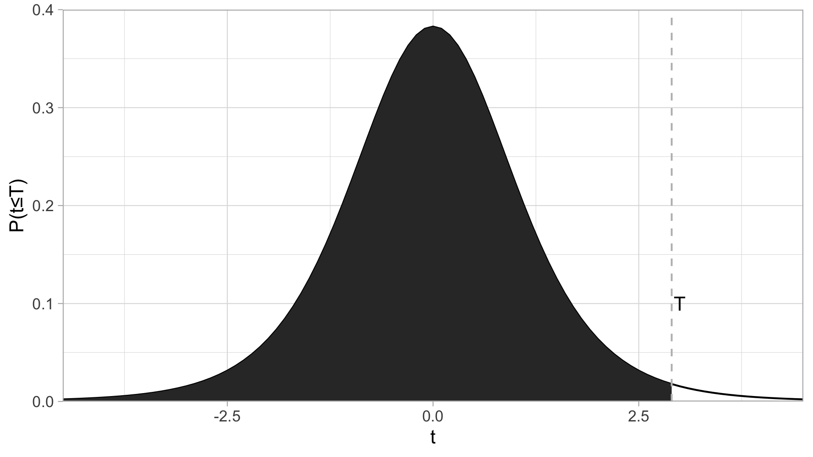

# 向量，逻辑，循环和函数 {#vectors-logicals-and-functions}

### 本章内容速览 {-#intro-overview-vector}

- 第\@ref(vector-section)节介绍了R中向量的概念，使用方法和优越性。
  - \@ref(create-vector)：向量的创建（赋值）和合并
  - \@ref(indexing)：向量的索引（indexing）和取子集（subsetting）
  - \@ref(generator)：生成有序数列（连续整数，重复数/重复向量，
  - \@ref(vector-misc)：向量的其它操作
  - \@ref(vectorization-basics)：向量的优越性——向量化计算概念基础
- 第\@ref(data-types)节介绍了R中的数据/对象类型
  - \@ref(data-types-basics)：如何查看数据/对象的类型；最基础的5种（atomic vector所存储的）数据类型；其它常用数据/对象类型
  - \@ref(data-types-advanced)：数据类型详解；更多的数据类型
- 第\@ref(math)节介绍了R中的数学规则
  - \@ref(math-notation)：数的表达；整数，浮点数，科学计数法
  - \@ref(arithmetic)：基础的数学运算
  - \@ref(statistics)：基础的统计学计算，包括t分布，t检验，卡方检验
- 第\ref(logical-operation)节介绍了R中逻辑值(`TRUE`, `FALSE`, `NA`)的概念和玩法。

*注意，R中的变量名/自定义函数名不能以数字和特殊符号开头，中间只能使用"_"和"."作为特殊符号*[^naming]

[^naming]: 如果一定要违反规则，可以使用转义符号`\``，比如可以`` `4foo%b=a+r` <- 50 ``


## 向量的概念，操作和优越性 {#vector-section}

R没有标量，它通过各种类型的向量 (vector)来存储数据。

### 创建向量（赋值）{#create-vector}

与很多其他的计算机语言不同，在R中，`<-`（像一个小箭头）用于给**向量，数据框和函数**赋值（即在每行的开头）。在RStudio中，可以用`Alt`+`-` (Mac是 `option`+`-`) 这个快捷键打出这个符号。

```{r}
x <- 2
x
```


要创建一个多元素的向量，需要用到`c()` (concatenate)函数：

```{r}
nums <- c(1,45,78)
cities <- c("Zürich", "上海", "Tehrān")
nums
cities
```

通过`length()`函数，可以查看向量的长度。

```{r linewidth=60}
length(nums)
#如果无后续使用，没必要赋值一个变量；c(...)的计算结果就是一个向量，并直接传给`length()`函数
length(c("Guten Morgen")) 
```

（每个被引号包围的一串字符，都只算做一个元素，因此长度为1；多元素的向量请看第\@ref(create-vector)节）

还是通过`c()`函数，可以把多个向量拼接成一个大向量：

```{r}
cities_1 <- c("Zürich", "上海", "Tehrān")
cities_2 <- c("大阪", "Poznań", "Екатеринбу́рг")

cities <- c(cities_1, cities_2, c("Jyväskylä", "부산", "เชียงใหม่"))

cities
```

### 索引/取子集 (indexing/subsetting) {#indexing}

索引 (index)就是一个元素在向量中的位置。R是从1开始索引的，即索引为1的元素是第一个元素（因此用熟了Python和C可能会有些不适应）。在向量后方使用方括号进行取子集运算（即抓取索引为对应数字的元素；虽然subsetting翻译成“取子集”有点怪，但是没毛病；不知大家有没有更好的翻译方法，或是不翻译更好）。

```{r}
x <- c("one", "two", "three", "four", "five", "six", "seven", "eight", "nine")
x[3]
```

可以在方括号中使用另一个向量抓取多个元素：

```{r}
x[c(2,5,9)] # 第2个，第5个，第9个元素
```

经常，我们会抓取几个连续的元素。如果想知道方法，请继续往下看。

### 生成器 {#generator}

有时候我们需要其元素按一定规律排列的向量，这时，相对于一个个手动输入，有更方便的方法：

#### 连续整数 

```{r}
1:10 #从左边的数（包含）到右边的数（包含），即1:10
```

这时，你应该会有个大胆的想法：

```{r}
x[3:6]
```

没错就是这么用的，而且极为常用。

当元素比较多的时候： 

```{r}
y <- 7:103 #复习一下赋值
y
```

注意到了左边方括号中的数字了吗？它们正是所对应的那一行第一个元素的索引。

下面的内容可能有点偏，**可以酌情从这里跳到第\@ref(vectorization-basics)节。**

#### 复读机`rep()` {#rep}

```{r}
rep(6, 8) # 把6重复8遍；或rep(6, times = 8)
```

```{r}
rep(c(0, 7, 6, 1), 4) # 把(0, 7, 6, 1)重复4遍
```

```{r}
rep(c(0, 7, 6, 1), each = 4) # 把0, 7, 6, 1各重复4遍
```

```{r}
rep(c(0, 7, 6, 1), c(1, 2, 3, 4)) # 把0, 7, 6, 1分别重复1, 2, 3, 4遍
```

想一想，`rep(8:15, rep(1:5, rep(1:2, 2:3)))`的计算结果是什么？

#### 等差数列: `seq()`

公差确定时：

```{r}
seq(0, 15, 2.5) # 其实是`seq(from = 0, to = 50, by = 5)`的简写
```

长度确定时：

```{r}
 seq(0, 50, length.out = 11) # 其实是`seq(from = 0, to = 50, length.out = 11)`的简写
```

#### 随机数：
 
连续型均匀分布随机数用`runif(n, min, max)`，n是数量，min是最小值，max是最大值。默认min为0，max为1。

```{r}
x_unif <- runif(100000, 40, 60) # 生成100000个40到60之间，连续均匀分布的的随机数
hist(x_unif) # 画直方图
```

正态分布随机数用`rnorm(n, mean, sd)`, 三个参数分别为数量，平均值，标准差。默认mean为0，sd为1。

```{r}
x_norm <- rnorm(100000, 250, 20) # 按照平均值为250，标准差为20的正态分布的概率密度函数生成100000个随机数
hist(x_norm) # 画直方图
```

### 向量的其他操作 {#vector-misc}

#### 创建长度为0的向量

使用循环的时候，经常需要初始化一个长度为0的向量（见第\@ref(control-flow)节

有两种方法实现：

```{r}
x <- vector("numeric")
# 或`vector("integer")`, `vector("character")`等
class(x)
```

或者：

```{r}
x <- integer(0)
# 或 x <- integer()
# 或`character(0)`, `numeric(0)`等
class(x)
```

其中后面这种方法亦可用于创建长度为$n$的向量，把0替换成你想要的长度即可。

#### `sort()`, `rank()`和`order()`

```{r eval=FALSE}
x <- c(2, 5, 3, 6, 10, 9, 7, 8, 1, 4)
sort(x)
rank(x)
order(x)
rev(sort(x))
# 为方便同框展示，我用的代码是 list(x = x), `sort(x)` = sort(x), `rank(x)` = rank(x), `order(x)` = order(x), `rev(sort(x))` = rev(sort(x)))
```

```{r echo=FALSE}
x <- c(-10, 5, -89, 999, 84)
list(x = x, `sort(x)` = sort(x), `rank(x)` = rank(x), `order(x)` = order(x), `rev(sort(x))` = rev(sort(x)))
```

`sort()`很好理解，就是把原向量的元素从小到大重新排列。如果要从小到大：`rev(sort(x))`. 

`rank()`是原向量各个元素的（从小到大的）排名。（`-10`是第2名，`5`是第3名，`-89`是第1名，以此类推）

`order()`是一个原向量索引的排序，使得`x[order(x)] = sort(x)`，即`x[order(x)] = x[c(3, 1, 2, 5, 4)] = c(-89, -10, 5, 84, 999) = sort(x)`

至于文字向量，英文按`a, b, c, d, e, ...`排列，中文按笔画排列。

#### 元素的命名

```{r}
scores <- c(ochem = 79, math = 66, mcb = 64, blc = 75, bpc = 72)
scores
```

然后便可以额外地用名字抓取元素：

```{r}
scores[c("math", "bpc")] == scores[c(2, 5)]
```


### R向量的优越性 {#vectorization-basics}

R中的向量（矩阵和数列也是）的各种计算默认都是逐元素 (elementwise)的。比如：

```{r}
x <- c(4, 9, 25)
y <- c(8, 6, 3)
x + y
x * y # 在matlab中这样乘是不行的，要用`.*`，除法也是
sqrt(x)
```

拥有这种特性的计算也被称为向量化计算 (vectorized computation).

相比于常用的编程语言，向量化计算省去了for循环，计算效率得到极大的提升；相比于matlab的默认矩阵乘法，逐元素乘法在数据处理中更有用。

若想更多地了解向量化计算（比如如何把for循环需要39秒的运算压缩到0.001秒），请看第\@ref(apply)节。

## 数据/对象类型 (Data/Object Types) {#data-types}

### 基础的数据/对象类型 {#data-types-basics}

#### 向量所存储的数据类型

向量所存储的的数据类型有5种：

|类型     |含义与说明            |例子                        |
|:--------|:---------------------|:---------------------------|
|numeric  |浮点数向量            |`3`, `0.5`, `sqrt(2)`, `NaN`, `Inf`|
|integer  |整数向量              |`3L`, `100L`                |
|character|字符向量；需被引号包围|`"1"`, `"$"`, `"你好"`      |
|logical  |逻辑向量              |`TRUE`, `FALSE`, `NA`       |
|complex  |复数向量              |`3+5i`, `1i`, `1+0i`        |

**一个向量的所有元素必须属于同一种类型。**如果尝试把不同类型的元素合并成一个向量，其中一些元素的类型会被强制转换 (coerced)。你可以试试`c(2, "a")`, `c(2+5i, 4)`, `c(TRUE, 1+9i)`和`c(TRUE, 1+9i, "a")`，但是实际操作的时候尽量不要这么做。

#### 关于数据类型的简单操作

通过`class()`函数，可以查看数据/对象的类型。

```{r}
class(6) # 6是一个（浮点）数，应为"numeric"
```

通过`is.XXX()`函数，可以得到一个逻辑值，指明此数据/对象是否属于某个类型，`TRUE`为是，`FALSE`为否。比如：

```{r}
is.numeric(6)
is.character("6")
```

通过`as.XXX()`函数，可以把数据/对象强行转换成另一种类型，比如：

```{r}
as.integer(c(TRUE, FALSE))
as.character(c(23, 90))
```

#### `NA`, `Inf`, `NaN`和`NULL`

`NA`为缺损值，意思是该元素所代表的数值丢失/不确定/不可用。举个例子，当我们统计学生的200m跑成绩时，有一些学生因为身体不适未能参与测试，这时他们的成绩应被记为`NA`：

```{r}
time_in_sec <- c(29.37, 28.66, 31.32, NA, 27.91, NA)
```

之前说过，一个向量中，所有的元素都是同一类型的。的确，这里的`NA`的类型是`numeric`:

```{r}
class(time_in_sec[4])
```

同理，`character`向量里的`NA`，类型也是`character`，其他类型也是一样的道理。如果只是单个的`NA`, 它的类型是`logical`:

```{r}
y <- c("a", "b", NA)
class(y[3])
class(NA)
```

`Inf`（无限）`NaN`（非数）的概念，以及作为`numeric`的`NA`的数学计算在第\@ref(math-NA)小节讨论。

作为`logical`的`NA`的逻辑运算在第\ref(logical-operation)小节讨论。

`NULL`是“无”，**真正的“无”。**它几乎一无是处，因此在此不作更多讨论。学有余力者可以自己去了解。

#### 其它的数据/对象类型

- Dataframe/tibble 是R中存储复杂（多变量）数据的规范格式，从第\ref(tibble)章开始将一直占据我们话题的中心。
- 因子 (factor)有很多向量的特性，尤其是能在dataframe/tibble中作为变量，但是它并不是向量；因子的详细内容在第\@ref(factors)节。
- 函数 (function)。我们刚才用`c()`来创建向量，它就是一个函数：`class(c)`；函数的详细内容在第\@ref(functions)节。
- list类似于向量，但是一个list可以包含不同类型的元素。性质和使用方法也和向量大相径庭。详细内容在第\@ref(list)节，算是较为进阶的内容。
- 矩阵 (matrix)和数组 (array)可以算作是二维和多维的向量，同样只能存储一种类型的数据，详细内容在第\@ref(matrix-array)节，同样是较为进阶的内容。

### 数据类型（严谨版） {#data-types-advanced}

可以酌情跳到第\@ref(math)节。

#### `class`, `type`, `mode`和`storage mode`

其实`class`根本不是基础的数据类型。学过编程的应该猜到了，此`class`正是OOP里的“类”，是“高层”的类型。你可以随意篡改`class`：

```{r}
x <- c("Joe", "Lynne", "Pat")
class(x) # 本应为"character"
class(x) <- c("high_school", "student") # 篡改
class(x) # 新class
```

用`typeof()`, `mode()`, `storage.mode()`所获取到的三种属性是不可篡改的“底层”类型。

## 数学表达和运算 {#math}

### 数的表达 {#math-notation}

#### 浮点数

除非指定作为整数（见下），在R中所有的数都被存储为双精度浮点数的格式 (double-precision floating-point format)，其`class`为`numeric`。

```{r}
class(3)
```

这会导致一些有趣的现象，比如$(\sqrt{3})^2 \neq 3$：~~（强迫症患者浑身难受）~~

```{r}
sqrt(3)^2-3
```

浮点数的计算比精确数的计算快很多。如果你是第一次接触浮点数，可能会觉得它不可靠，其实不然。在绝大多数情况下，牺牲的这一点点精度并不会影响计算结果（我们的结果所需要的有效数字一般不会超过10位；只有当两个非常，非常大且数值相近对数字相减才会出现较大的误差）。

`NaN`（非数）和`Inf`（无限大）也是浮点数！

```{r}
class(NaN)
class(Inf)
```

#### 科学计数法

在R中可以使用科学计数法(`AeB`$= A \times 10^B$)，比如：

```{r}
3.1e5
```
```{r}
-1.2e-4+1.1e-5
```

#### 整数

整数的class为`integer`。有两种常见的方法创建整数：
1）在数后面加上`L`；

```{r}
class(2)
class(2L)
```

2）创建数列

```{r}
1:10 #公差为1的整数向量生成器，包含最小值和最大值
class(1:10)
seq(5,50,5) #自定义公差，首项，末项和公差可以不为整数
class(seq(5,50,5)) #因此产生的是一个浮点数向量
seq(5L,50L,5L) #可以强制生成整数
class(seq(5L,50L,5L)) #是�整数没错
```

整数最常见的用处是indexing（索引）。

##### 整数变成浮点数的情况

这一小段讲的比较细，**请酌情直接跳到下一节（\@ref(arithmetic)）。**

整数与整数之前的加，减，乘，求整数商，和求余数计算会得到整数，其他的运算都会得到浮点数，（阶乘(`factorial`)也是，即便现实中不管怎么阶乘都不可能得到非整数）：
```{r include=FALSE}
x <- list(2L+1L, 2L-1L, 2L*3L, 17L%/%3L, 17L%%3L, 1000L/1L, 3L^4L, sqrt(4L), log(exp(5L)),factorial(5L),sin(0L))
for (num in x){
  print(num)
  print(class(num))
}

y <- c(8L/2L, 2L^3L)
```

```{r}
class(2L+1L)
class(2L-1L)
class(2L*3L)
class(17L%/%3L)
class(17L%%3L)
```

```{r}
class(1000L/1L)
class(3L^4L)
class(sqrt(4L))
class(log(exp(5L)))
class(factorial(5L))
```

整数与浮点数之间的运算，显然，全部都会产生浮点数结果，无需举例。

另外一个需要注意的地方是，取整函数\@ref(quzheng)并不会产生整数。如果需要的话，要用`as.integer()`函数。

### 运算 {#arithmetic}

#### 二元运算符号

R中的binary operators（二元运算符）有：

|  符号     |     描述    |
|:---------:|:-----------:|
|   `+`     | 加          |
| `-`       | 减          |
| `*`       | 乘          |
| `/`       | 除以        |
| `^`或`**` | 乘幂        |
|`%/%`      |求整数商，比如`7%%3`$=2$|
|`%%`       |求余数，比如`7%%3`$=1$|

其中求余/求整数商最常见的两个用法是判定一个数的奇偶性，和时间，角度等单位的转换。（后面再详细介绍）。

#### $e^x$和$\log_x{y}$

`exp(x)`便是运算$e^x$。如果想要$e=2.71828...$这个数：

```{r}
exp(1)
```

`log(x, base=y)`便是运算$\log_y{x}$，可以简写成`log(x,y)`（简写需要注意前后顺序，第\@ref(abbr)有解释）。

默认底数为$e$：

```{r}
log(exp(5))
```

有以10和2为底的快捷函数, `log10()`和`log2()`

```{r}
log10(1000)
log2(128)
```

#### 近似数（取整，取小数位，取有效数字）{#quzheng}

取有效数字用`signif()`函数；第一个参数是对象，第二个参数是保留的位数；若保留的位数未指定，默认为6.

```{r}
signif(12.3456789, 4)
```

当对象的有效数字小于你想保留的有效数字位数时，它不会让你乱来（下面`round()`函数也类似）：

```{r}
signif(12.3, 8)
```

保留小数位用`round()`函数。

```{r}
round(12.3456789, 3) # 保留3个小数位
```

若不指定保留多少位，默认为0，即四舍五入地取整：

```{r}
round(13.5)
```

此外，还有三种取整函数：`floor()`, `ceiling()`和`trunc()`

```{r eval=FALSE}
floor(5.6) # = 5 # “地板”；比x小的最近的整数
ceiling(5.4) # = 6 # “天花板”；比x大的最近的整数
floor(-5.6) # = -6 # 不是-5，因为-6是比-5.6小的最近的整数
ceiling(-5.4) # = -5 # 不是-6；因为-5是比x大的最近的整数
trunc(-5.6) # = -5 # 你可能需要这个；它无视了小数点后面的位数
```

注意，所有取整函数给出的的结果都并不是整数！

```{r}
class(ceiling(7.4))
```

虽然浮点数使用起来真没啥不方便的，但是如果你一定需要的话，可以用`as.integer()`函数把它转换成真·整数。

#### `NA`, `Inf`, `NaN`相关 {math-NA}

我不知道张三有几个苹果，我也不知道李四有几个苹果；你问我张三和李四共有几个苹果：

```{r}
NA + NA
```

鬼才知道咧！

类似地，`NA - NA`, `NA/NA`, `NA*NA`, `log(NA)`都等于`NA`

`NA^0`等于几？别上当！R的开发者们可没有忘记$\forall x\in \mathbb{R:x^0 = 1}$

`Inf`, 即$\infty$, 表示很大的数字（准确地说，大于等于$2^{1024}$即$1.797693\times10^{308}$的数字）它还有个负值，`-Inf`. 以下是几个结果为`Inf`的例子：

```{r eval=FALSE}
exp(1000) # = Inf; 这个很明显
1/0 # = Inf; 0被当作很小的数
0^(-1) # = 1/(0^1) = 1/0 = Inf
log(0) # = -Inf; 0又被当作很小的数
```

`NaN`是“非数” (not a number). 运算结果为`NaN`的例子有：

```{r eval=FALSE}
0/0 # NaN
log(-1) # = NaN
0^(3+8i) # = NaN + NaNi
Inf-Inf; Inf/Inf # = NaN
-NaN # = NaN
```

`Inf`和`NaN`的类型是`numeric`（浮点数）.

```{r}
class(Inf); class(NaN)
```


#### R中自带的数学函数集合

基础

|函数          |描述          |
|:---------------|:-------------|
|`exp(x)`        |$e^x$         |
|`log(x,y)`      |$\log_yx$     |
|`log(x)`        |$\ln(x)$     |
|`sqrt(x)`       |$\sqrt{x}$    |
|`factorial(x)`  |$x!=x\times(x-1)\times(x-2)\ldots\times2\times1$|
|`choose(n,k)`   |$\binom{n}{k}=\frac{n!}{k!(n-k)!}$（二项式系数）|
|`gamma(z)`      |$\Gamma(z)=\int_0^\infty x^{z-1}e^{-x}dx$（[伽马函数](https://en.wikipedia.org/wiki/Gamma_function)）|
|`lgamma(z)`     |$\ln(\Gamma(z))$|
|`floor(x)`, `ceiling(x)`, `trunc(x)`, |取整；见上一小节。|
|`round(x, digits = n)`|四舍五入，保留n个小数位，n默认为0|
|`signif(x,digits = n)`|四舍五入，保留n个有效数字，n默认为6）|
|`sin(x)`, `cos(x)`, `tan(x)`|三角函数|
|`asin(x)`, `acos(x)`, `atan(x)`|反三角函数|
|`sinh(x)`, `cosh(x)`, `tanh(x)`|双曲函数|
|`abs(x)`|$|x|$（取绝对值）|
|`sum(...)`, `prod(...)`|所有元素相加之和/相乘之积|

### 简易的统计学计算 {#statistics}

本节简要解释了R中的基础统计学函数，t分布，t检验和$\chi^2$检验。统计学方法并不是本书的重点，因此可以酌情跳到[下一章](#tibble)。

#### 基础

中位数`median()`; 平均数`mean()`; 方差`var()`; 标准差`sd()`.

#### t分布

众所周知，t分布长这样：

```{r echo=FALSE}

```

阴影面积为$P(t<T)$，虚线对应的$t$为$T$.
`qt()`可以把$P(t≤T)$的值转化成$T$,`pt()`则相反。

假设你需要算一个confidence interval（置信区间），confidence level（置信等级）为$95\%$，即$\alpha=0.05$，degrees of freedom(自由度)为$12$，那么怎么算$t^*$呢？

```{r}
qt(0.975, df = 12)
```

为什么是$0.975$？因为你要把$0.05$分到左右两边，所对应的t*就等同于t分布中，$P(t ≤ T) = 0.975$时T的值。

再举一个例子，你在做t检验，双尾的，算出来$t=1.345$，自由度是$15$，那么$p$值怎么算呢？

```{r}
p <- (1-(pt(2.2, df = 15)))*2
p
```

其中`pt(2.2, df = 15)`算出阴影面积（$P(t≤T)$的值），1减去它再乘以2就是对应的双尾t检验的$p$值。

#### z分布

没有z分布专门的函数。可以直接用t分布代替，把`df`调到很大（比如`999999`）就行了。比如我们试一下$95\%$置信区间所对应的$z*$：

```{r}
qt(0.975,9999999)
```

（果然是$1.96$）

#### t检验

t检验分为以下几种：

- One sample t test （单样本）
- paired t test（配对）
- Two sample...（双样本）
  - Unequal variance (Welch) t test（不等方差）
  - Equal variance t test（等方差）
  
在R中做t检验，很简单，以上这些t检验，都是用`t.test` 这个函数去完成。

以单样本为例：

```{r}
x <- c(2.23,2.24,2.34,2.31,2.35,2.27,2.29,2.26,2.25,2.21,2.29,2.34,2.32)
t.test(x, mu = 2.31)
```

可以看到$p=0.06766$。

R的默认是双尾检验，你也可以设置成单尾的：

```{r}
x <- c(2.23,2.24,2.34,2.31,2.35,2.27,2.29,2.26,2.25,2.21,2.29,2.34,2.32)

t.test(x, mu = 2.31, alternative = "less") # 检验是否*less* than μ
```

$p$值瞬间减半。

双样本/配对:

```{r}
x <- c(2.23,2.24,2.34,2.31,2.35,2.27,2.29,2.26,2.25,2.21,2.29,2.34,2.32)
y <- c(2.27,2.29,2.37,2.38,2.39,2.25,2.39,2.16,2.55,2.81,2.19,2.44,2.22)

t.test(x, y)
```

R的默认是non-paired, unequal variance，你可以通过增加`paired = TRUE`，`var.equal = TRUE`这两个参数来改变它。

```{r}
t.test(x, y, paired = TRUE)
```

#### $\chi^2$ 检验

$\chi^2$检验有两种，goodness of fit test（适配度检验）和contigency table test/test of independence（列联表分析/独立性检验）。都是用`chisq.test()`函数去完成。

##### 适配度检验

假设我们制造了一个有问题的骰子，使1至6朝上的概率分别为：

```{r}
expected_probs <- c(0.05, 0.1, 0.15, 0.2, 0.2, 0.3)
```

然后我们投掷了100次，实际1至6朝上的次数分别为：

```{r}
observed_vals <- c(6, 9, 14, 24, 18, 29)
```

通过`chisq.test()`，检验实际的1至6朝上概率是否与预期有偏差：

```{r}
chisq.test(observed_vals, p = expected_probs) # 参数p是指概率
```

p值很大（远大于0.05），因此结论是骰子各面朝上的概率符合预期。

如果不指定p参数，默认为检测是否所有值相等（即骰子的所有面朝上的概率相等）：

```{r}
chisq.test(observed_vals)
```

这时p值小于0.05. 得出“骰子各面朝上的概率不等”的结论。

##### 列联表分析/独立性检验

假设我们有一组不同年级的学生参加社团的人数数据：

```{r}
(社团参与 <- matrix(c(28,36,40,40,32,33,38,29,36), nrow = 3, dimnames = list(c("一年级", "二年级", "三年级"), c("棒球", "足球", "网球"))))
```

我们想知道社团的参与，与所在年级是否是独立事件：

```{r}
chisq.test(社团参与)
```

p值不小于0.05，无法拒绝“社团的参与，与所在年级是独立事件”的虚无假设。

彩蛋：用R代码实现卡方分布的概率密度函数的图像：

```{r}
#其实还可以更精简，但是为了易读性不得不牺牲一点精简度。
Z <- matrix(rep(rnorm(1000000), 6), nrow = 6)^2

X <- Z^2

Q <- matrix(nrow = 6, ncol = 1000000)

for (i in (1+1):6) {
  Q[1,] = Z[1,]
  Q[i,] = Q[(i-1),] + Z[i,]
}

plot(NULL, xlim=c(0.23,6), ylim = c(0,1),
     main = expression(paste('X ~ ', chi^'2', '(k)')), 
     xlab = "x", 
     ylab= expression(f[k]*'(x)')
    )
colors <- c('blue', 'black', 'red', 'green', 'gray', 'orange')
for (i in 1:6) {
  lines(density(Q[i,]),
        col=colors[i],
        lwd=2)
}
legend('topright',c('k=1','k=2','k=3','k=4','k=5','k=6'),
       fill = colors)
```

##### 其他

R自带的检验还有`Box.test()`, `PP.test()`, `ansari.test()`, `bartlett.test()`, `wilcox.test`等共31种。查看帮助文件或利用网络资源以了解更多。

## 逻辑 {#logical-operation}

### 逻辑值 {logical-values}

逻辑值有三个。`TRUE`, `FALSE`和`NA`.

```{r}
class(c(TRUE,FALSE,NA))
```

`TRUE`为真，`FALSE`为假，`NA`为未知（即真假难辨）。

### 关系运算符和简单的逻辑运算 {#logical-operations}

R中常用的关系运算符有：

|符号|描述|
|:--:|:----:|
|`==`  |equal to（等于）|
|`!=`  |equal to（不等于）|
|`<`|less than（小于）|
|`>`|more than（大于）|
|`<=`|less than or equal to（小于等于）|
|`>=`|more than or equal to（大于等于）|

这些关系运算符只能用于(atomic) vectors, 不能用于其他类型的R对象；`indentical()`函数可以用于所有类型的对象，用来确认两者是否完全一致。

使用关系运算符进行计算，会产生逻辑值作为结果。比如：

```{r}
x <- 5
x != 3 #x等于5，所以“x不等于3”为真
```

有一些其他的运算符或函数也会返回逻辑值，比如

```{r}
7 %in% c(1,4,5,6,7)
```

顾名思义，这个运算符是用来检测一个元素是否在另一个向量中。其它类型的运算符，我在需要用到的时候再讲。

有很多种运算会以`NA`作为计算结果，在此不一一列举。最重要的一个是：

```{r}
NA == NA
```

这看起来像是一个bug，然而仔细想想才发现这个设计很巧妙。假设你问我是否知道我的一些朋友写完了暑假作业。我说我**不知道**张三是否写完了，也**不知道**李四是否写完了。你再问我“张三和李四的作业完成情况是一样的吗”？鬼才知道咧！

这意味着不能直接使用`x == NA`来判断`x`是否是`NA`，而要用`is.na()`函数：

```{r}
x <- NA
is.na(x)
```

#### 逻辑运算符

以下是最常用的三个逻辑运算符。

|符号|描述|
|:--:|:----:|
|`&`|AND（且）|
|`|`|OR（或）|
|`!`|反义符号|

#### 反义符号（`!`）

`!`使`TRUE` `FALSE`颠倒。一般，我们用小括号来包住一个逻辑运算，然后在它的前面加上一个`!`来反转结果，比如

```{r}
!(3 < 4) # 这个例子很简单，反义符号意义不大。后面实操的时候才能领略到它的用处。
```

#### 多个逻辑运算的组合（`&`（且）和`|`（或））

`&`和`|`可以把多个逻辑运算的结果合并成一个逻辑值。

`&`判断是否两边运算结果都为`TRUE`。如果是，才会得到`TRUE`（即一真和一假得到假）。

`|`判断两边运算结果是否至少有一个 `TRUE`，如果是，就会得到`TRUE`。

不用死记硬背！其实就是“且”和“或”的逻辑。

用脑子想一下以下三条运算的结果，然后复制代码到R console对答案。

```{r eval=FALSE}
1 == 1 & 1 == 2 & 3 == 3 #即：“1等于1且1等于2且3等于3”，是真还是假？
FALSE | FALSE | TRUE # FALSE/TRUE等价于一个运算结果
!(FALSE | TRUE) & TRUE # 注意反义符号
```

我们可以查看三个逻辑值所有两两通过`&`组和的计算结果（如果你不感兴趣，可以不关注方法。这里重点是结果）：

```{r}
vals <- c(TRUE, FALSE, NA) 
names(vals) <- paste('[',as.character(vals),']',sep = '')
outer(vals, vals, "&")
```

可以看到，`FALSE`与任何逻辑值组合，结果都是`FALSE`。这个好理解，因为一旦一个是`FALSE`，那么不可能两边都是`TRUE`. `TRUE & NA`之所以为`NA`（而不是`FALSE`），是因为`NA`的意思是“不能确定真假”，即有可能真也有可能假。因此`TRUE & NA`也无法辨真假。

再来看`|`的组合：

```{r}
outer(vals, vals, "|")
```

可以看到，`TRUE`与任何一个逻辑值组合，都是`TRUE`，而`FALSE | NA`为`NA`。原因一样（因为`NA`的不确定性）。


## 判断和循环（流程控制） {#control-flow}

### 给有编程基础者的快速指南

如果没编程基础，没接触过判断和循环，请看第\@ref(kickstart)小节。

如果学过其他编程语言，知道判断和循环的作用，只是需要知道在R中的表达，那么请看以下两个例子快速入门，然后跳至第\@ref(functions)节：

```{r}
m <- 1:100 # 产生一个[1,2,3,...,99,100]的整数向量。上面讲过。
n <- vector("numeric")
for (i in n) {
  if (i %% 2 == 0) {
    n <- append(n, i^2)
  } else if (i == 51) {
    break
  }
}
n
```

```{r}
logi = TRUE
num <- 1
while (num <= 100) {
  if (logi) {
    num = num + 10 # R 不支持 num += 5的简写
    print(num)
    logi = FALSE
  } else {
    num = num + 20
    print(num)
    logi = TRUE
  }
}

```

### 无编程基础者的快速指南 {#kickstart}

我认为，举例子比纯粹的概念灌输更容易理解。

#### `if`, `else if`, `else`语句（“如果……”，“或者，如果……”，“否则……”）

```{r}
# 以下代码翻译成英语就是：If 1 + 1 = 2, print "hi". Else, print "bye".
# 或中文：如果一加一等于二，那么印出“hi”，否则印出“bye”.
if (1 + 1 == 2) { # 1 + 1 == 2 的运算结果是TRUE，因此“如果”成真
  print("hi") # 所以会执行`print("hi")`
} else {
  print("bye")
}
```

```{r}
# 代码第一行中的FALSE可以替换成任何计算结果为FALSE的运算，
# 比如1 + 1 == 3；小括号内的计算过程不重要，
# 但运算结果必须为TRUE或FALSE（不可以是NA）
if (FALSE) { 
  print("hi")
} else { # 因为是FALSE，所以`else`里的语句被执行
  print("bye")
}
```

```{r}
if (FALSE) { # 第一个`if`为FALSE
  print("hi")
} else if (FALSE) { # 检查下一个`else if`，也是FALSE
  print("yoo")
} else if (TRUE) { # 再检查下一个`else if`，这次是TRUE
  print("hey") # 所以执行`print("hey")`
} else {
  print("bye") # 而轮不到else
}
```

#### for循环

```{r}
# 以下代码翻译成英文就是: for every element i in c(2, 4, 6, 8): 
# assign i^2 to n, then print n
# 中文：对c(2, 4, 6, 8)`中的每一个元素i：
# 创建一个n使得n等于i的平方，然后印出n
for (i in c(2, 4, 6, 8)) { # i可以是任何你想要的名字，比如num
  n <- i^2 # 如果上一行是 for (num in ..., 这一行就要写成 n <- num^2
  print(n)
}
```

```{r}
x <- vector(mode = "numeric") # 创建一个空的numeric vector
for (m in 1:10) {
  if (m %% 2 == 0) {
    x <- append(x, m)
  }
}

x
```

```{r}
M <- c(1, 2, 3 ,4 ,5)
N <- c(10, 100, 1000)

x <- vector("numeric")
for (m in M) {
  for (n in N) { # 在一个for循环中嵌入另一个for循环
    x <- append(x, m*n)
  }
}

x
```

**实际操作中，要想尽办法避免for循环，尤其是以上这种双层（多层）嵌套的for循环！**原因和方法请看第\@ref(apply)节。

#### while循环

```{r}
x <- 1
while (x < 10) { # 当x<10的时候，执行大括号内的语句
  print(x)
  x <- x + 3 # 一定要让x的值增加，否则会进入无限循环
}
```

#### `break` 和 `next`

```{r}
for (i in 1:10) {
  if (i == 3) {
    next # 当i == 3时，跳过它，继续（最近的）for循环的下一个回合
  } else if (i == 6) {
    break # 当i == 6时，结束（最近的）for循环
  } 
  print(i) # 只有当if和else if里的检验都为FALSE时，`print(i)`才会执行。
}
```

```{r}
M <- c(1, 2, 3, 4, 5)

x <- vector("numeric")
for (m in M) {
  while (TRUE) { # 原本while(TRUE){}将会是一个无限循环（判定条件永远TRUE）
    x <- append(x, 2*m)
    break # break打破了最近的这个while循环，而不影响for循环。
  }
}

x
```

### 严谨版

如果看懂了[上一节](#kickstart)中的例子，并且作为新手不太想深究，完全可以暂时跳过这一节，前往第\@ref(functions)节。

#### `if`, `else`, `else if` 语句

`if else`语句长这样：

```{r eval=FALSE}
if (something is true) {
  do something
} else {
  do some other things 
}
```

其中小括号内为测试的条件，其运算结果需为TRUE或FALSE（不能是`NA`！）。如果你还不熟悉关于逻辑值的计算，请看第\@ref(logical-operation)节。

- 若运算结果为TRUE：大括号内的语句将会被执行。（如果语句只有一行，大括号可以省略）

- 如运算结果为FALSE：
  - 如果后面没有`else`语句：什么都不会发生。
  - 如果后面有`else`语句：`else`后（大括号里）的语句将会被执行。
  
R中没有专门的`elseif`语句，但用`else`加上`if`能实现同样的效果。`else if`可以添加在`if`语句之后，顾名思义（“或者如果”），它的作用是，如果前一个`if`测试的条件为`FALSE`，那么再新加一个测试条件。一整个`if/else/else if`代码块里可以包含多个`else if`. 

注意，不能直接用`x == NA`来判断`x`是否是`NA`，而要用`is.na(x)`. 否则会得到`NA`的结果。

#### for循环

#### while循环

#### repeat循环

#### `break`和`next`

### 如何避免for循环——`apply()`家族函数 {#apply}

R中的循环效率是很低的，尤其是有多层嵌套。通过`system.time()`函数，看看你的电脑执行以下运算需要花多少秒：（`system.time()`函数在第\@ref(system-time)小节有介绍）

```{r eval=FALSE}
x <- vector("numeric")
system.time(
  for (l in 1:40) {
    for (m in 1:50) {
      for (n in 1:60) {
        x <- append(x, l*m*n)
      }
    }
  }
)
```

我的i5处理器(i5-8259U CPU @ 2.30GHz)花了39秒左右才能算出来，然而看起来计算量并不大：
$$x = \left(1\times1\times1, 1\times1\times2\ldots, 40\times50\times59, 40\times50\times60\right)$$
一共有$40\times50\times60 = 120000$次计算. 一个原因是，无论你的CPU有多少核心，R默认只会使用其中的一个进行计算。在第\@ref(parallel)节中介绍了开挂使用多核的方法。但是它治标不治本，解决for循环缓慢的终极方案是避免使用for循环，而使用向量化的方法进行计算 (vectorized computation)。在第\@ref(vectorization-basics)我介绍了简单的（二元）向量化计算。除了二元运算以外，很多时候，复杂的for loop也能用向量化计算实现。我们需要用到`apply()`家族的一系列函数：`apply()`, `sapply()`, `lapply()`, `mapply()`, `tapply()`, `vapply()`, `rapply()`, `eapply()`；此外，像`Map()`, `rep()`, `seq()`等函数也会执行向量化的计算。

在学习它们的用法之前，先来看一个直观的数据：

|方法|$(L,M,N)=(1:40,1:50,1:60)$|$(L,M,N)=(1:500,1:600,1:700)$|
|:-------|:----------------:|:--------------------:|
|普通（单核）for循环 |39秒  |等了一小时，无果，遂弃|
|开挂（四核）for循环|12.304秒；CPU巨热|怕CPU炸，不敢试|
|`sapply()`|0.001秒         | 2.719秒              |
|`rep()` |0.002秒           | 2.825秒              |
|`mapply()` |0.004秒           | 4.302秒           |
|`rapply()` |0.003秒           | 2.094秒           |
|`Map()` |0.004秒           | 3.106秒              |

同样是运算上面那个for循环花了39秒的例子，使用`sapply()`函数和`rep()`函数几乎是瞬间完成；而把$(l,m,n)$增至$(1:500,1:600,1:700)$时（计算量为1750倍），它们仍只需不到3秒，而for循环则是不可行的。

（源码在）

#### `lapply()`

`lapply()` (list apply)有两个参数，第一个是对象（可以是vector或者list），第二个是函数。它的作用是把函数作用于对象中的每一个元素，并返回一个list.

无论对象是vector还是list, 返回的都是一个list: 

```{r}
lapply(c(1, 2, 3), function(i) i*10) # vector
lapply(list(1, 2, 3), function(i) i*10) # list
```

```{r}
lapply(list(c(1, 2), c(4, 6), c(7, 9)), function(i) i*10)
```

#### `sapply()`

`sapply()` (simplified list apply)的功能和`lapply()`几乎一样。`sapply()`额外的一个特点是尽可能地化简结果：

- 当结果只有一个list元素时，`sapply()`返回一个vector
- 当结果有多个list元素，但每个list元素只包含一个vector且长度相等时，`sapply()`会返回一个matrix

试试以下计算：

```{r eval=FALSE}
lapply(c(1, 2, 3), function(i) i*10)
sapply(c(1, 2, 3), function(i) i*10)

lapply(list(c(1, 2), c(4, 6), c(7, 9)), function(i) i*10)
sapply(list(c(1, 2), c(4, 6), c(7, 9)), function(i) i*10)

lapply(list(1, 2, 3), function(i) i*c(1, 10, 100))
sapply(list(1, 2, 3), function(i) i*c(1, 10, 100))

lapply(list(c(1, 2), c(4, 6), c(7, 9)), function(i) i*10)
sapply(list(c(1, 2, 3), c(4, 6), c(7, 9)), function(i) i*10)
```

#### `mapply()`和`Map()`

`mapply()`的意思是“`Map+sapply`”，它的计算过程和`Map()`函数类似，但是会像`sapply()`一样把结果化简。

简单地说，有些函数把参数中的vector作为一个整体使用，而用`mapply()`/`Map()`可以把这些vector逐元素地使用。而且，`mapply()`/`Map()`可以对多参数的函数进行向量化计算，因此`mapply()`的“m”经常被解释为代表“multivariate”.

假设你想创建一个这样的vector：

```{r echo=FALSE}
rep(1:4, each = 3)
```

通过复习第\@ref(rep)节，很容易得出答案：

```{r eval=FALSE}
rep(1:4, each = 3)
```

粗心的读者可能以为是：

```{r eval=FALSE}
rep(1:4, 3) # 即rep(1:4, times = 3)
```

而实际上它的运算结果是：

```{r echo=FALSE}
rep(1:4, 3)
```

因为`1:4`（即`c(1, 2, 3, 4)`）被作为一个整体使用了。正确的写法是：

```{r eval=FALSE}
as.vector(mapply(rep, 1:4, 3))
```

`mapply(rep, 1:4, 3)`的第一个参数是所需函数的名字，其它的参数为所需函数的参数。你可以指名道姓：`mapply(rep, x = 1:4, times = 3)`，或者根据排序键入参数而无需指定参数名（见第\@ref(abbr)节）。其中第一个参数 (`1:4`)不是长度为1的vector，因此它会被`mapply()`转换成list并执行逐元素运算，即运算过程和结果为：

```{}
mapply(rep, 1:4, 3)
= mapply(rep, c(1, 2, 3, 4), 3)
= list(rep(1, 3), rep(2, 3), rep(3, 3), rep(4, 3))
= list(c(1,1,1), c(2,2,2), c(3,3,3), c(4,4,4))

# 等价于 sapply(list(1, 2, 3, 4), function(x) rep(x, 3))
```

为什么我们实际上看到的是一个matrix呢？这是因为每个list元素所含的vector的长度相等，因此自动化简为matrix. 若要查看未化简的版本：

```{r eval=FALSE}
mapply(rep, 1:4, 3, SIMPLIFY = FALSE)
```

或者

```{r}
Map(rep, 1:4, 3)
```

你可能已经发现，用`sapply()`函数其实也可以较为简单地实现这个例子：`sapply(1:4, function(x) rep(x, 3))`；那`mapply()`/`Map()`有没有其它特殊的特性呢？有。多参数的向量化运算。对于多参数的函数，`sapply()`只能使用其中的第一个进行向量化运算，而其他的参数必须为常数。而`mapply()`/`Map()`可以这样：

```{r}
Map(seq, c(1, 5, 20), c(5, 25, 100), length.out = 5)
```

它执行了三次计算：`seq(1, 5, length.out = 5)`, `seq(2, 25, length.out = 5)`和`seq(20, 100, length.out = 5)`.

想一想，这个结果是否可以化简？如果是，化简结果是什么？用`mapply()`函数执行同样的计算来验证你的答案。

当对象是一个list的时候，

```{r}
Map(rep, list(c(8, 9), c(6, 7)), 3)
```

```{r}
lapply(list(c(8, 9), c(6, 7)), function(x) rep(x, 3))
```


想一想，`Map(rep, list(c(1,2), list(2,3)), 3)`的计算结果是什么？

#### `rep()`

还是上一小节中的vector：

```{r echo=FALSE}
rep(1:4, rep(3, 4))
```

其实可以仅用`rep()`函数简洁地实现：

```{r eval=FALSE}
rep(1:4, rep(3, 4))
```

如果不明白为什么，请复习第\@ref(rep)节。

### `foreach` package：for循环的进化版 {#foreach}

```{r include=FALSE}
require(doParallel)
```

`foreach` package相对于base R中的for循环增加了一些特性，不过最实用的是支持多核并行运算：

#### 使用多内核进行计算 {#parallel}

首先需要安装和使用`doParallel`，然后才可以使用`foreach`中的`%dopar`进行多核并行运算。

查看和设置内核数量：

```{r}
library(doParallel)
getDoParWorkers() # 查看R当前使用的内核数量；默认应为1
detectCores() # 查看可用内核总数
```

```{r}
registerDoParallel(4) # 设置内核数量
getDoParWorkers() # 再次检查内核数量
```

设置完之后就可以使用`%dopar`进行多核并行运算了：

```{r eval=FALSE}
x <- foreach(l = 1:40, .combine = "c") %dopar% {
    foreach(m = 1:50, .combine = "c") %dopar% {
        foreach(n = 1:60, .combine = "c") %do% {
        l*m*n
        }
    }
}
x
```

相比单核for循环的39秒，开挂（四核）的速度是12秒（计算量越大，优势越明显）。

## 函数 {#functions}

### R中的函数 {#functions-in-R}

不像很多其他语言的函数（和方法）有`value.func()`和`func value`等格式，R中所有函数的通用格式是这样的：

```{}
function(argument1 = value1, argument2 = value2, ...)
```

比如

```{r}
sample <- c(5.1, 5.2, 4.5, 5.3, 4.3, 5.5, 5.7)
# 根据传统，赋值变量时用`<-`号，赋值函数参数时才用`=`
t.test(x = sample, mu = 4.5)
```

二元运算符和`[`（取子集符号）看起来一点都不像函数，而实际上它们也是函数，因此也可以用通用的格式使用他们，只是需要加上引号：

```{r}
"+"(2, 3)
```

```{r}
"["(c("四川担担面", "武汉热干面", "兰州牛肉面", "北京炸酱面"), 2)
```

可自定义的二元运算符形式为`%x%`, 其中`x`为任何字符。（见第\@ref(binary-operaters)节）

（英语中，“parameter”或“formal argument”二词用于函数定义，“argument”或“actual argument”二词用于调用函数[@Kernighan1988The-C-Programming-La]，中文里分别是“形式参数”和“实际参数”，但是多数场合简称“参数”。）

### 调用函数 {#abbr}

根据通用格式（`function(argument1 = value1, argument2 = value2, ...)`）调用函数。对于二元运算符，`a %x% b`等价于`"x"(a, b)`.

从“`function(`”开始到此函数结尾的“`)`”中间为参数，参数用逗号隔开，空格和换行会被忽略，“`#`”符号出现之处，那一行之后的内容都会被忽略。这意味着你可以（丧心病狂地）像这样调用一个函数。

```{r}
sum        (
 # 4   
        4 # 我怕不是
,              #疯了哦
            6
  
  )
```

它实际的好处是，当参数很长或是有嵌套的函数时，可以通过换行和空格使代码更易读，就像其它的编程语言一样。

函数的参数以`seq`函数为例，通过查看documentation（在console执行`?seq`）可以查看它的所有的参数：

```{}
## Default S3 method:
seq(from = 1, to = 1, by = ((to - from)/(length.out - 1)),
    length.out = NULL, along.with = NULL, ...)
```

可以看到第一个参数是`from`，第二个是`to`，第三个是`by`，以此类推。因此我们执行`seq(0, 50, 10)`的时候，R会自动理解成`seq(from = 0, to = 50, by = 10)`。而想用指定长度的方法就必须要写清楚是`length.out`等于几。

`length.out`本身也可以简写：

```{r}
seq(0, 25, l = 11)
```

因为参数中只有`length.out`是以`l`开头的，`l`会被理解为`length.out`. 但是这个习惯并不好；自己用用就算了，与别人分享自己的工作时请务必使用标准写法。

### 创建函数 {#create-functions}

#### 普通函数 {#general-functions}

```{r}
函数名 <- function(参数1, 参数2, ...){
  对参数1和参数2
  进行
  一系列
  一行或者多行
  计算
  return(计算结果)
}
```

在R中，函数是作为对象保存的，因此定义函数不需要一套另外的符号/语句，还是用赋值符号`<-`，和`function()`函数。

R自带了计算样本标准差 (standard deviation, $s$)的函数, `sd()`，我们可以根据它写一个计算均值标准差（即“标准误”, standard error）（$SE=s_{\bar{x}}=\frac{s}{\sqrt{n}}$）

```{r}
SE <- function(x) {
  s <- sd(x)
  n <- length(x)
  result <- s/sqrt(n)
  return(result)
}
# 随后，你就可以使用自定义的函数了
SE(c(5,6,5,5,4,5,6,6,5,4,5,3,8)) 
```

这里其实可以做一些省略。很多时候，最后一“句”的**计算结果**（不是赋值计算）就是我们想`return`的结果。因此，这时`return`可以省略：

```{r}
SE <- function(x) {
  s <- sd(x)
  n <- length(x)
  s/sqrt(n) # 注意不是`result <- s/sqrt(n)`
}
SE(c(5,6,5,5,4,5,6,6,5,4,5,3,8)) 
```

很多时候，函数内部有复杂流程控制，这时使用`return()`可以很大地增强易读性：

```{r}
# 这是随手写的一个没有意义的函数
myfunc <- function(i){
  k <- 8
  if (i>3) {
    j <- -i
    while(j < 20){
      k <- k + i + j
      j <- j+5
    }
    return(k)
  } else {
    if (i %% 2 == 0) {
      return(5)
    } else return(k*i)
  }
}
myfunc(6)
```

#### 无名函数 {#anonymous-functions}

本章剩余的内容，都是比较进阶的了。可以酌情从这里跳转至本章第\@ref(test-base)节。

函数不需要名字也可以执行。一般，会与`apply`族函数联用（见第\@ref(apply)节）：

```{r}
sapply(1:5, function(x) x^2)
```

或者用于


#### 二元运算符 {#binary-operaters}

定义二元运算符的方式和定义普通函数的方法极其类似，只是参数必须要有且仅有两个（否则作为“二元”运算符就无意义了），且运算符名称需要用引号包围。

比如我们可以定义一个计算椭圆面积的函数

```{r}
'%el%' <- function(x, y) pi*x*y

2 %el% 5
```

原则上，可自定义的二元运算符不一定要用`%`包围；`+`, `-`, `:`等符号的功能都可以被自定义，但是它们是R自带的，非常常用的函数，重定义它们只会带来麻烦。

#### 闭包 (Closure) {#closure}

函数里可以包含着另一个函数，这就形成了一个闭包：

```{r}
myfunc <- function(){
  a = 5
  function(){
    b = 10
    return(a*b)
  }
}
# 执行myfunc()的时候，默认结果为最后一句/一行，在这里应为内函数：
myfunc()

# 既然`myfunc()`的结果是一个函数，那么在后面再加上一个括号就是执行内函数了；内函数可以使用外函数中所定义的变量（比如这里使用了外函数的`a = 5`）
myfunc()()
```

```{r}

speak <- function(x){
  x()$speak
}

speak(cat)

```

#### 伪·OOP

我貌似，捣鼓出了一种完全使用R中的简易函数实现伪·OOP的方法（R中的真·OOP是有三种，S3，R6和S4）：

```{r}
Cat <- function(name){
  name = name
  binomial_name <- "Felis catus"
  speak <- "Meow"
  greet <- function(time = "not_specified"){
    intro <- paste("my name is", name)
    if(time == "morning") print(paste("Good morning,", intro))
    if(time == "afternoon") print(paste("Good afternoon,", intro))
    if(time == "evening") print(paste("Good evening,", intro)) 
    if(time == "not_specified") print(paste("Hi,", intro))
  }
    paste("Hi, my name is ", name)
  list(name = name, binomial_name = binomial_name, speak = speak, greet = greet)
}

Felix <- Cat("Felix")
Felix$name
Felix$greet("morning")
```

**inheritance和polymorphism的实现**

```{r}
Pet <- function(name = NA, common_name = NA, binomial_name = NA, speak = NA){
  name <- name
  common_name <- common_name
  binomial_name <- binomial_name
  speak <- speak
  greet <- function(time = "not_specified"){
    intro <- paste("I'm a", common_name, "and my name is", name)
    if(time == "morning") print(paste("Good morning,", intro))
    if(time == "afternoon") print(paste("Good afternoon,", intro))
    if(time == "evening") print(paste("Good evening,", intro)) 
    if(time == "not_specified") print(paste("Hi,", intro))
  }
    paste("Hi, my name is ", name)
  list(name = name, common_name = common_name, binomial_name = binomial_name, speak = speak, greet = greet)
}


Turtle <- function(name = NA){
  Pet(name, "turtle", "Trachemys scripta elegans") # 实现inheritance # 龟没有叫声
}

Cat <- function(name = NA, sterilized = NA){
  sterilized <- sterilized # 猫可能绝育 # 新增attribute，实现了广义的polymorphism
  PetAaM <- Pet(name, "cat", "Felis catus", "Meow")
  CatOnlyAaM <- list(sterilized = sterilized)
  c(PetAaM, CatOnlyAaM)
}

# 实现了Python语境中的polymorphism
greet <- function(pet, time = "not_specified"){
  pet$greet(time)
}

binomial_name <- function(pet){
  pet$binomial_name
}
```

使用例：

```{r}
Felix <- Cat("Felix", "TRUE")
Kazuya <- Turtle("Kazuya")

Felix$binomial_name
Kazuya$greet("afternoon")
greet(Felix, "morning")
sapply(list(Kazuya, Felix), binomial_name)
```

没有`class`，没有`self`，没有`__init__`，*it just works*.

### 关于`...`

有时候，你想写的函数可能有数量不定的参数，或是有需要传递给另一个函数的“其他参数”（即本函数不需要的参数），这时候可以在函数定义时加入一个名为`...`的参数，然后用`list()`来读取它们。list是进阶内容，在第\@ref(list)节有说明。

比如我写一个很无聊的函数：

```{r}
my_func <- function(arg1, arg2 = 100, ...){
  other_args <- list(...)
  print(arg1)
  print(arg2)
  print(other_args)
}

my_func("foo", cities = c("崇阳", "Αθήνα", "つがる"), nums = c(3,4,6))
```

`arg1`指定了是`"foo"`（通过[简写](#abbr)），因此第一行印出`"foo"`;  `arg2`未指定，因此使用默认值`100`，印在第二行。`cities`和`nums`在形式参数中没有匹配，因此归为"..."，作为list印在第三行及之后。

### 测速 {#system-time}

当你开始处理复杂，大量的数据时，或是向别人分享自己的代码时，代码执行的速度变得重要。

一段代码/一个函数经常有很多种写法，哪种效率更高呢？实践是检验真理的唯一标准，R提供了一个测速函数：`system.time()`函数。

```{r}
x <- vector('numeric')
system.time(
  for (i in 1:50){
    for (j in 1:100) {
      x <- append(x, i*j)
    }
  }
)
```

其中第三个数字 (`elapsed`)是执行`system.time()`括号内的语句实际消耗的时间。可以使用索引 (`[3]`)抓取。

如果括号内的语句大于一句，像这样：

```{r eval=FALSE}
system.time(
  1 + 1
  2 + 1
)
```

R会报错。就像流程控制里学到的那样，需要用大括号包围多行/多句的语句，就像这样：

```{r eval=FALSE}
system.time({
  1 + 1
  2 + 1
})
```

### 列表 (list) {#list-intro}

R中的list是一种特殊的数据存储形式。使用`list()`函数来创建lists.

尝试对lists和vectors使用`is.vector()`, `is.list()`, `is.atomic()`和`is.recursive()`函数，你会发现list虽然也是“vector”，但我们一般说的“vector”都是指只能存储一种数据类型的atomic vector；而lists是recursive vector. 

这意味着**一个list能存储多种类型的数据，且可以包含子list**。list中的每个元素可以是**任何R中的对象** (object)：除了常用的 (atomic) vector和另外一个（子）list以外，还可以有dataframe/tibble和函数：

```{r}
y <- list(1, c("a","あ"), list(1+3i, c(FALSE, NA, TRUE)), 
          tibble(x = c("阿拉木图", "什切青"), y = c(2, 3)),
          t.test)
y
```

#### list的索引/取子集 {#list-index}

使用上面的例子：

```{r}
y[2] # 使用单方括号，得到的是一个只有一个list元素的list
y[[2]] # 使用双方括号，得到的是一个vector
y[[3]][[2]] # 得到的也是一个vector；父list的索引在前，子list的在后
y[[3]] # 这个位置包含两个子list，因此得到一个有两个list元素的list
y[[3]][[2]][2] # 得到vector时，直接在后面用单方括号
```

list里的元素可以有名字；被命名的元素可以通过`$`符号抓取：

```{r}
z <- list(c(1, 3), z2 = c(4, 5, 6), c("a", "b"))
z # `[[2]]`被`$z2`所取代
z$z2 == z[[2]] # `z[[2]]`仍然是可用的，结果和`z$z2`一样
```

#### 合并与拆解

通过`c()`函数来合并多个列表。

```{r eval=FALSE}
c(list(1, 2), list(3, 4, list(5,6)))
# 将等同于list(1, 2, 3, 4, list(5,6))
```

也许你想把需要“合并”的列表作为子列表放在另一个列表里；这也很简单，在本节一开始就讲了：

```{r}
list(list(1, 2), list(3, 4))
```

通过`unlist()`函数来拆解列表中的子列表。若参数`recursive`为`TRUE`（默认值），将一直拆解至无子列表的列表，如果此最简列表的元素都属于五种atomic vector中的数据[^unlist-df]，此列表还会被进一步化简成向量。若`recursive = FALSE`，最“靠外”的一级列表（可能是多个）将会被拆解。

[^unlist-df]: dataframe也是可以unlist成向量的，但是并不实用。（试试`unlist(list(data.frame(x = c(1,2), y = c(3,4)), 5, 6))`）

```{r eval=FALSE}
unlist(list(1, list(2, list(3, 4)), list(5, 6), 7, 8, 9))
# 将等同于c(1, 2, 3, 4, 5, 6, 7, 8, 9) 
# 注意被化简成了向量

unlist(list(1, list(2, list("a", 4)), list(5, TRUE), 7L, 8, 9+0i))
# 将等同于c("1", "2", "a", 4, 5, "TRUE", "7", 8, "9+0i")
# 化简成向量时，非字符元素被强制转换成字符了

unlist(list(1, list(2, list(t.test, 4)), list(5, TRUE), 7L, x, 9+0i))
# t.test无法存储于向量中，因此最简结果为一个list：
# list(1, 2, t.test, 4, 5, TRUE, 7L, x, 9+0i)


unlist(list(1, list(2, 3, list(4, 5)), list(6, 7), 8, 9), recursive = FALSE)
# 将等同于list(1, 2, 3, list(4, 5), 6, 7, 8, 9)
```

因此，当`A`, `B`为列表，`unlist(list(A, B), recursive = FALSE)`等同于`c(A, B)`.

#### 其他性质和操作

上面说到`unlist(list(A, B), recursive = FALSE)`等同于`c(A, B)`，你可能很想用`==`验证一下。很不幸，你会得到一条错误信息：

```{}
comparison of these types is not implemented
```

在第\@{logical-operations}节讲过，`==`只能用于atomic vectors；对于列表（和其他对象）可以用`identical()`函数确认两者是否完全一致。

```{r}
A <- list("a", 1, TRUE); B <- list(5+8i, NA, 4L)
C1 <- unlist(list(A, B), recursive = FALSE); C2 <- c(A, B)
identical(C1, C2)
```


### array（数组）和matrix（矩阵）简介 {#matrix-array}

Vector是一维的数据。Array是多维的数据。Matrix是二维的数据，因此matrix是array的一种特殊情况。

Dataframe不是matrix（虽然都是方的）. Matrix是二维的，**仅包含数字**的**array**. Dataframe是一个二维的**list**，不同列（即list元素）**可以存储不同的数据类型**。

我们可以用`dim()`来创建arrays：

```{r}
A <- 1:48 #创建一个(1,2,3,...24)的numeric vector
dim(A) <- c(6,8) #给A assign一个6乘4的dimensions
A
```

可以看到我们创建了一个二维的，array, 因此它也是一个（4行6列的）matrix。

```{r}
is.array(A)
is.matrix(A)
```

注意24个数字排列的方式。第一个维度是行，所以先把4行排满，随后再使用下一个维度（列），使用第2列继续排4行，就像数字一样，（十进制中）先把个位从零数到9，再使用第二个位数（十位），以此类推。下面三维和四维的例子可能会更清晰。

同时注意最左边和最上边的[1,], [,3]之类的标记。你应该猜出来了，这些是index. 假设你要抓取第五行第三列的数值：

```{r}
A[5,3]
```

或者第三行的全部数值：

```{r}
A[3,]
```

或者第四列的全部数值：

```{r}
A[,4]
```

接下来我们再看一个三维的例子（还是用1-48）：

```{r}
dim(A) <- c(2,8,3)
A
```

它生成了三个二维的矩阵。在每个2*8的矩阵存储满16个元素后，第三个维度就要加一了。每个矩阵开头的`, , x`正是第三个维度的值。同理，我们可以生成四维的array：

```{r}
dim(A) <- c(3,4,2,2)
A
```

观察每个矩阵开头的`, , x, y`.  x是第三个维度，y是第四个维度。每个二位矩阵存满后，第三个维度（x）加一。x达到上限后，第四个维度（y）再加一。

类似二维矩阵，你可以通过index任意抓取数据，比如：

```{r}
A[ ,3 , , ] #每个矩阵第3列的数据，即所有第二个维度为3的数值
```

### 给matrices和arrays命名

假设我们记录了3种药物（chloroquine, artemisinin, doxycycline)
对5种疟原虫(P. falciparum, P. malariae, P. ovale, P. vivax, P. knowlesi)的疗效，其中每个药物对每种疟原虫做6次实验。为了记录数据，我们可以做3个6*5的矩阵：（这里只是举例子，用的是随机生成的数字）

```{r}
B <- runif(90, 0, 1) #从均匀分布中取100个0到1之间的数
dim(B) <- c(6, 5, 3) #注意顺序
B
```

然后我们用`dimnames()`来命名：

```{r}
dimnames(B) <- list(paste("trial.", 1:6), c('P. falciparum', 'P. malariae', 'P. ovale', 'P. vivax', 'P. knowlesi'), c('chloroquine', 'artemisinin', 'doxycycline'))
B
```

**清清楚楚，一目了然。**

### 小测 {#test-base}

(@) **转换年份到世纪。**写一个名为`as.century`的函数，把存储着年份的向量，比如`years <- c(2014, 1990, 1398, 1290, 1880, 2001)`，转换成对应的世纪（注意，19XX年是20世纪）。
(@) **斐波那契数列。**
  - **背景：**斐波那契数列是指$F = [1, 1, 2, 3, 5, 8, ...]$，其中：
    - $F_1 = 1$，$F_2 = 1$
    - 从$F_3$开始，$F_i = F_{i-2} + F_{i-1}$ 
  - (也有$F_0=0, F_1=1$的说法，但是为了方便我们不用这个定义)
  - **题目：**创建一个函数名为`fibon()`的函数，使得`fibon(i)`：
    - 当$i\in \mathbb{Z}^+$时，返回向量$[F_1, F_2, \ldots, F_i]$
    - 当$i\notin \mathbb{Z}^+$时，返回`` "请输入一个正整数作为`fibon()`的参数。" ``
  - **提示：**
    - 虽然在R中整数用`1L`, `2L`等表示，用户在被指示“输入整数”的时候很有可能输入的是`2`而不是`2L`. `2`是否等于`2L`?如果是，如何利用它检测输入的是否是整数？（`2`和`2L`都要被判定为“是整数”）
    - 斐波那契数列前两位是定义，从第三位开始才是计算得出的。

