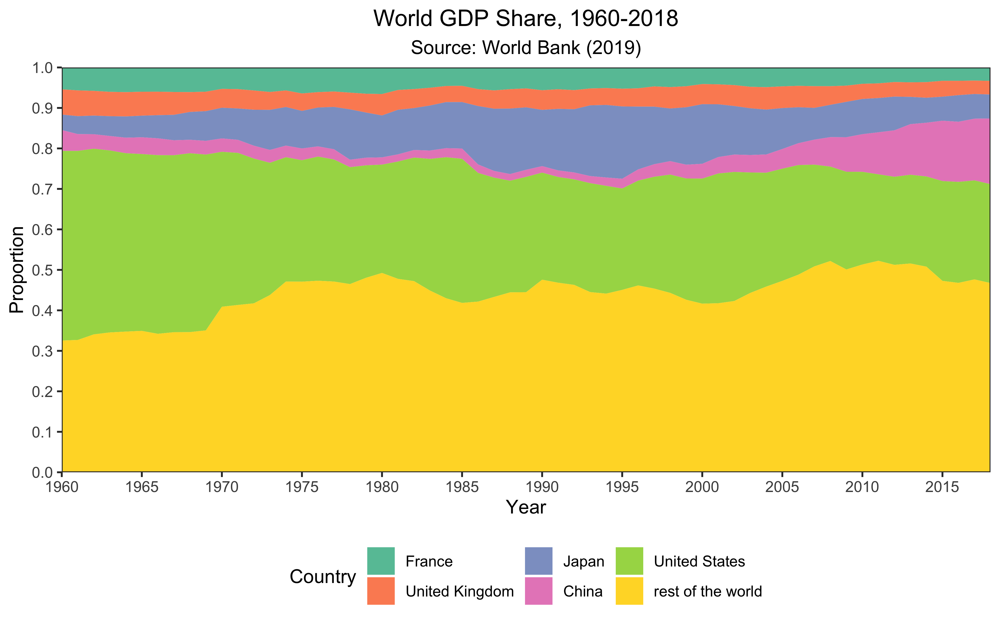

# 数据处理 {#wrangle}

## 整齐数据 {#untidy-to-tidy}

在这一节，我们使用`tidyr`里的几组数据：`tidyr::table1`, `tidyr::table2`, `tidyr::table3`, `tidyr::table4a`, `tidyr::table4b`. 它们的内容都是一样的，但是只有`tidyr::table1`是整齐的数据。其它几个都是因种种原因而不整齐的数据。

这个数据记录了阿富汗，巴西和中国三个国家，在1999年和2000年这两个年份中，肺结核病例数和总人口数量。在往下看之前，问一下自己，自变量和因变量是什么？

不难理解，国家和年份是自变量，病例数和人口数是因变量。

### 不整齐的常见问题

在第\ref(tibble-concept)节讲过，“tidy data”的定义很简单：

> 每一行代表的是一次（且仅一次）observation，每一列代表的是一个（且仅一个）变量。

判断某一列是否是一个变量的方法很简单：问自己，这一列的标题是否直接反映了这一列所含的数据？

判断一行是否是一次observation（观察），首先我们需要清楚自变量是什么。每个自变量的组合和它对应的因变量为一行。

我们看`table1`:

```{r}
tidyr::table1
```

每一列的标题是否直接反映了这一列所含的数据？是的，阿富汗，巴西和中国都是国家；1999, 2000都是年份；745, 2666等都是病例数；19987071, 20595360等都是人口数量。

每一行是否是一次观察？是的，这里的自变量是国家和年份。3个国家，2个年份，共6种组合，每种组合刚好一行。

我们再看`table2`: 

```{r}
tidyr::table2
```

每个自变量之组合出现了两次（比如有两次`China`+`1999`），且有一列意义不明（名称和数据的关联不直接）：把`cases`和`population`各称作一个“type”并不合适，它们俩自身显然就可以作为一个变量名。

再看`table4a`和`table4b`

```{r}
tidyr::table4a; tidyr::table4b
```

它是数据分成了两组，病例数和人口。它们的变量命名很糟糕：`745`, `37737`和`212258`分别都是一个“1999”吗？显然用年份作为变量名很不合适。

```{r}
tidyr::table3; tidyr::table5
```

`table3`和`table5`的问题不大，只是对元数据进行了一些处理。在下面会介绍方法把它们转换成像`table1`那样，整齐且通用性强的数据。

### 解决方案

## 数据的导入和导出 {#import-export}

### 导入 {#data-import}

#### csv

#### excel

#### 其它

### 导出

## 文本和字符串 {#strings}

文本和字符串是一个复杂的话题。十进制数字永远由0-9构成，并且一个数字永远代表一个值；逻辑值永远只有`TRUE`, `FALSE, `NA`；而文本的内容千变万化：它有字母，有数字，有标点符号，有空格空行；不同的语言有不同的书写和标点符号规则；同样的文字可能有不同格式的编码；同样的一个字可能有不同的含义……这使文本的处理比数值的处理丰富且复杂得多。本书仅介绍几个重要的概念，具体的细节请查看相关的文档。

### `stringr`和`stringi`包

`stringi`（http://www.gagolewski.com/software/stringi/ ）提供了一系列高效可靠，功能丰富的函数用于处理任何编码的任何语言的文本。`stringr`（https://stringr.tidyverse.org ）是`stringi`的简洁版，囊括了`stringi`中对于数据分析最常用的函数。`stringr`是`tidyverse`的一部分，因此加载`tidyverse`的时候会自动加载`stringr`.

`stringr`中的函数名都是以`str_`开头的，后面我们会看到很多例子。

`stringr()`的cheatsheet（https://www.rstudio.com/resources/cheatsheets/#stringr ）非常实用，尤其是第二页的正则表达。一定要把它背熟！

### 基础

字符串必须用单引号和双引号包围。在双引号包围的环境下，可以很容易打出英澳常用的单引号和欧洲语言中的“撇”；在单引号包围的环境下，可以很容易打出北美和中国常用的双引号。否则需要使用转义字符 (escape character), `\`. 以下是几个正确的例子。

```{r}
"'The unexamined life is not worth living' —Socrates"
"La science n'a pas de patrie."
'"老子曰：“知不知，尚矣；不知知，病矣。"'
'l\'homme'
```

用反斜杠进行转义后，

```{r}
x <- "Joe says \"Hi!\""
```

直接`print()`并不能看出什么名堂：

```{r}
x # 即`print(x)`
```

我们要使用`writeLines()`来查看所有需要转义的地方处理之后的结果：

```{r}
writeLines(x)
```

如果想表达一个字面意思的反斜杠`\`，你需要输入`"\\"`.

```{r}
writeLines("\\")
```

`\n` (newline)为换行符，`\t` (tab)为制表符。

```{r}
writeLines(c("Guten\n\n\tMorgen.", "Guten\n\n\tTag"))
```

所有的通过`\`实现的符号请参见`help("'")`（关于引号的帮助）。此外，请通过`stringr()`的cheatsheet了解正则表达式中通过`\`实现的更多patterns.

### 正则表达式

正则表达式 (regular expression, regex, RE)用于匹配符合特定规则/模式 (pattern)的字符组合。

`stringr`提供了一个帮助理解学习正则表达式的函数，它会高亮所有的匹配字符，`str_view_all()`[^str-view]. 它的第一个参数是字符串，第二个是模式（即规则）：

[^str-view]: `str_view()`只会显示第一个匹配，`str_view_all()`会显示全部。后面讲到的所有以`_all`结尾的函数都有其对应的非`all`版本，只会作用于第一个匹配。

```{r}
str_view_all(c("Plasmodium falciparum", "Schizosaccharomyces pombe"), "m")
```

这是最简单的一种匹配：直接用无特殊含义的字母/数字。下面这个例子是用`\d`匹配字符串中所有的数字：

```{r}
str_view_all("as9df2gh5jk7lo2", "\\d")
```

为什么要输入两个反斜杠呢？因为你要使用`\d`作为一个regex，而你需要把它通过字符的形式去输入，因此`d`前面那一个反斜杠需要通过另一个反斜杠去转义。当你实际上输入`"\\d"`时，R才会把这串字符理解成`\d`，即`writeLines("\\d")`. 同理，如果你要匹配一个字面的反斜杠，你需要输入`\\\\`:

```{r}
x <- "This is a literal \\"
x
```

```{r}
writeLines(x)
```

```{r}
str_view_all(x, "\\\\")
```

#### 细节

正则表达式的规则非常多，R关于正则表达式的官方文档在`?rergex`，不过我认为RStudio的cheatsheet（和`stringr`包一起的）更好用（https://www.rstudio.com/resources/cheatsheets/#stringr ）。

虽然刚接触的时候正则表达式很令人头大，但是多背，多用，很快你就能把它们记下来，然后正则表达式将会成为你可靠而强大的助手。

此外还有一些我认为有用的帮助理解正则表达式的文章（不一定是R语言里的，但是很多内容都是共通的）：

- https://www.cnblogs.com/libin-1/p/7004546.html

### 寻找匹配

`str_detect(string, pattern)`: 是否存在匹配？

```{r}
str_detect(c("abc", "cde", "bomb"), "b")
```

`str_which(string, pattern)`: 每个元素各有几处匹配？

```{r}
str_count(c("abc", "cde", "bomb", "bbb"), "b")
```

`str_locate_all(string, pattern)`: 查找所有字符串中匹配的位置：

```{r}
x <- c("Saccharomyces cerevisiae", 
                 "Cannizzaro reaction", 
                 "Meerwein-Ponndorf-Verley reduction", 
                 "bbb", 
                 "acd")
str_view_all(x, "(\\w)\\1") # 查找两个连续的字母
str_locate_all(x, "(\\w)\\1")
```

### 子集和修改

#### `str_sub()`：根据索引提取和修改子字符串

`str_sub(string, start = 1, end = -1)`: 根据索引提取子字符串。

```{r}
A <- c("Danio Rerio", "Xenopus Laevis")
str_sub(A, 1, 7) # 第1到第7个字符
str_sub(A, 4, 4) # 第4个字符
str_sub(A, -4, -2) # 倒数第4至倒数第2
```

我们还可以通过索引修改某个位置的字符：

```{r}
W <- "D. Rerio"
str_sub(W, 4, 4) <- str_to_lower(str_sub(W, 4, 4))
W
```

#### `str_subset()`：返回有匹配的字符串

`str_subset(string, pattern)`：返回有匹配的字符串

```{r}
str_subset(c("abc", "aaa", "bbb", "aca", "bbc", "asl"), "a")
```

#### `str_match_all()`和`str_extract_all()`：提取匹配的子字符串

`str_match_all(string, pattern)`: 第一列是匹配的整个子字符串，第二列和之后是每个正则表达圆括号组对应的子字符串。下面这个例子有两个圆括号组：

```{r}
str_match_all(sentences[1:5], "(a|the) ([^ ]+)")
```

`str_extract_all(string, pattern)`则只会返回整个子字符串。

```{r}
str_extract_all(sentences[1:5], "(a|the) ([^ ]+)")
```

#### `str_replace_all()：修改匹配的子字符串

`str_replace_all(string, pattern, replacement)`: 通过正则表达修改子字符串。这里我们把粗心的种名首字母大写改正成小写，然后再简写属名：

```{r}
A <- c("Danio Rerio", "Xenopus Laevis")
p1 <- "(?<=\\s)."
p2 <- "[:lower:]+(?=\\s)"
A %>% str_replace(p1, str_to_lower(str_extract(A, p1))) %>% 
  str_replace(p2, ".")
```

来一千个，一万个不标准的，长度不等的双名都不怕。

和`str_to_lower()`相关的函数还有`str_to_upper()`, `str_to_title()`和`str_to_sentence()`. 它们的作用都顾名思义。

### 合并和分解

#### `str_c()`：字符串的合并

`str_c(..., sep = "", collapse = NULL)`: 合并字符串：

```{r}
str_c("a", "b", "c", sep = "")
```

参数`sep`是被合并的字符串之间的连接字符；它可以是任何字符，包括空格和无（比如上面的例子；用`sep = ""`表示无连接字符）。

当需要合并的字符串保存在一个向量里时，用`collapse`而不是`sep`：

```{r}
str_c(c("a", "b", "c"), collapse = "[x@")
```

`str_c()`可以执行向量化运算：

```{r}
str_c("prefix", c("a", "b", "c"), "suffix", sep = "-")
```

```{r}

混沌在各地的称呼 <- str_c(
  str_c(
    "地区",
    c("北京", "湖北", "巴蜀", "两广", "闽台"),
    sep = "："
  ),
  str_c(
    "称呼",
    c("混沌", "包面", "抄手", "云吞", "扁食"),
    sep = "："
  ),
  sep = " "
)

writeLines(混沌在各地的称呼)
```

它还常与`if`语句联用：

```{r}
win <- 2
score <- str_c(
  "张三", 
  if (win == 1) "赢\n" else "输\n",
  "李四",
  if (win == 2) "赢" else "输",
  sep = ""
)
writeLines(score)
```

#### `str_split()`, `str_split_fixed()`

#### `str_glue()`, `str_glue_data()`


## Factors {#factors}

### 基础

有时候，我们的变量是以文字的形式呈现，但是它们不是单纯的文字，而是有大小的差别，或是能以一定顺序排列，比如十二个月份 (Jan, Feb, ...)，成绩的“优、良、中、差”，衣服的尺寸 (XS, S, M, XL, ...). 假设我们在做客户满意度调查，七位客户的反馈是

```{r}
满意度_v <- c("满意", "非常满意", "满意", "不满意", "满意", "非常不满",  "不满意")
```

我们试图用`sort()`把七个反馈按满意度从小到大排列：

```{r}
sort(满意度_v)
```

可见其排序并不是有意义的。（因为默认英语根据'abcde...'排序，中文根据笔画排序）

我们可以把这个vector做成factor，并用参数`levels`规定排序顺序：

```{r}
# 按照惯例，小的值在前，大的在后；“非常不满”应为满意度最低的值。
满意度_f <- factor(满意度_v, levels = c("非常不满", "不满意", "满意", "非常满意"))
sort(满意度_f)
```

这样排序就是正确的了。

```{r eval=FALSE}
class(满意度_f) # "factor"
is.vector(满意度_f) # FALSE
```

### 在绘图中的应用

### 高端操作

## 日期和时间 {#dttm}

日期和时间是一个很令人头疼的话题。不是所有的年都是365天，不是每天都是24小时，不是每分钟都是60秒[^not-all]。

[^not-all]: 闰年为366天；夏令时开始时的那一天只有23小时，结束时为25小时；地球的自转速度在缓慢下降，因此会有“闰秒”。

R自带的日期/时间方法不太好用，因此我们用一个叫做`lubridate`的package.

```{r eval=FALSE}
install.packages("lubridate")
library("lubridate")
```

### ISO标准

日期/时间的ISO标准格式是这样的：

```{r}
now()
```

最后三个字母是时区。

### 创建日期/时间

#### 现在的日期/时间

```{r}
today()
now()
```

#### 通过字符串转换

`date()`函数可以把ISO标准格式的日期，从字符串转换成日期的数据类型。

```{r}
class("2001-02-01")
date("2001-02-01"); class(date("2001-02-01"))
```

`ymd()`, `mdy()`, `dmy()`这三个函数可以很智能地把各种格式的日期转换成ISO标准的日期。

```{r}
X <- date("2001-02-01")
A <- ymd(010201)
B <-  mdy("February the 1st, 2001")
C <- dmy("01/FEB/01")
# 验证A, B, C全部等于X
sapply(list(A, B, C), identical, X)
```

如果想加上时间，使用有`_h`, `_hm`, `_hms`后缀的版本的函数：

```{r}
dmy_h("01-Feb-2001 17")
ymd_hms(010201173245)
```


### 计算

### 在绘图中的应用

## 小测 {#test-wrangle}

1. *描绘中华民族的伟大复兴和日、美、英、法等国的走衰。*

    从[世界银行的网站](https://data.worldbank.org/indicator/NY.GDP.MKTP.CD)，我们可以获取到1960年至2018年各国的GDP数据。为了一致性，请使用我做的一份拷贝 (https://github.com/TianyiShi2001/r-and-tidyverse-book-ans/tree/master/data/GDP/wb )。
    
    用这些数据，绘制下面这张面积图：
    
    ```{r}

    ```
    
    可以无视好看的颜色，标题，坐标轴，国家的排列顺序和其他的小细节。
    
1. **从网页链接中提取信息。**

    ```{r}
searches <- c(
  "https://www.bing.com/search?q=aspirin&go=Submit&qs=ds&form=QBLH",
  "https://www.bing.com/search?q=bacillus+thuringiensis&qs=LS&pq=bacillus+th&sc=8-11&cvid=851739CD82A24226B0AF73E8331008EE&FORM=QBRE&sp=1",
  "https://www.bing.com/search?q=the+unexamined+life+is+not+worth+living&go=Search&qs=n&form=QBRE&sp=-1&ghc=2&pq=the+unexam&sc=8-10&sk=&cvid=37894978539F4E9EAA213581D6F185AE", 
  "https://www.bing.com/search?q=heinz+wilhelm+guderian&qs=AS&pq=heinz+wilh&sk=SC1&sc=4-10&cvid=7C5F3F5769384F70BC0369316EFC51FA&FORM=QBRE&sp=2&ghc=1"
)
    ```

    把这些必应搜索的链接的搜索内容抓取出来（你可以在浏览器里打开这些链接，看看搜索框里的内容是什么）：

    ```{r echo=FALSE}
str_view_all(searches, "(?<=search\\?q\\=).+?(?=&)")
    ```

    ```{r include=FALSE}
s <- str_extract(searches, "(?<=search\\?q\\=).+?(?=&)")
s
    ```

    进而选择合适的函数把搜索内容做成一个字符向量：
    
    ```{r echo=FALSE}
S <- str_replace_all(s, "\\+", " ")
S
    ```